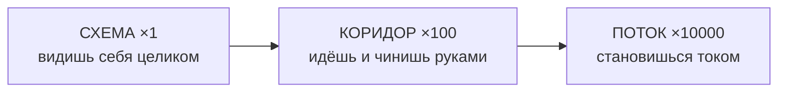
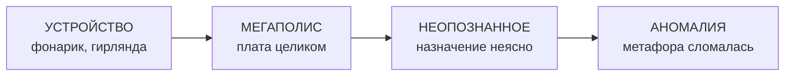

# Into Schem

> **Концепт-документ · черновик**
>
> 2D-игра внутри электрической схемы. Ток — светящийся поток под давлением, компоненты — сооружения, физика считается по-настоящему. Ты не человек, попавший внутрь: ты часть системы, и три режима игры — это три состояния, в которые ты умеешь переходить.

**v0.8** · 2026-08-21 · Godot 4 · 2D · Цель: играбельный прототип

---

**Легенда:** `[Зафиксировано]` — решено · `[Обсуждается]` — есть рабочая версия · `[Открыто]` — нужно решение

---

## 00 · Карта работы: версии и что дальше

### Как читать эту карту

Документ рос по одному решению за раз. Слева — что уже закрыто, справа — что дальше. Полная история версий — в самом низу, в [Changelog](#changelog).

### Пройденный путь

| Версия | Что закрыто |
| --- | --- |
| **v0.1** | Первый черновик: логлайн, словарь метафоры «электричество = гидравлика», где аналогия трещит |
| **v0.2** | Три режима приняты и связаны зумом; симулятор зафиксирован как честный MNA; вопрос масштаба времени |
| **v0.3** | Сеттинг как ось узнаваемости, а не выбор; условия победы; шесть устройств прототипа |
| **v0.4** | Персонаж зафиксирован как часть системы → три режима стали тремя состояниями; провал с откатом; визуальный язык; свет от тока |
| **v0.5** | Документ перенесён в Markdown — редактируется напрямую, а не через код HTML |
| **v0.6** | Закрыты последние блокирующие вопросы: библиотека номиналов, «Вскрытие» после аварии, ввод, ресурс перехода в «Поток». Заведён раздел «Входящие мысли» |
| **v0.7** | Принцип композиции узлов и защита от дрейфа в производственную игру (раздел 12); шесть новых мыслей в ящике — глобальный масштаб, макетка → плата, слои, техпроцесс и тепло |
| **v0.8** | Уровни 1–8 собраны, механика «свет открывает карту» зафиксирована и реализована, ящик мыслей разобран |
| **v0.9** | HTML-прототип пересобран целиком: прямое взаимодействие с деталями на плате, честный нагрев и сгорание во времени, победа как удержание условия, самописец, 14 уровней |
| **v0.10** | Пауза и навигация «что дальше»; исправлен баг транзистора в насыщении; уровень 15 «Силовой ключ» |
| **v0.11** | Источники стали честными — с внутренним сопротивлением — на всех 16 уровнях; уровень 16 «Холодный пуск» про просадку общей шины |
| **v0.12** | Уровень 17 «Верстак»: свободная сборка — игрок сам расставляет детали и разводит провода, вместо готовой платы автора уровня |
| **v0.13** | Тайна: узел не называет себя, пока не заработает, и отдаёт строку журнала изделия. Тридцать новых узлов в четырёх секторах. Разводка перестала набираться руками — её строит генератор из того же описания, что и цепь. Проверки перенесены из головы в `web/tests/` |
| **v0.14** (сейчас) | Пологое начало: четырнадцать сборок стенда ПЕРЕД прежним первым уровнем, по одному шагу каждая. Пятнадцать узлов сектора «Возврат» после ядра. Тайна перестала быть текстом и стала величиной: на шести платах приборы показывают ток, уходящий мимо схемы, и шесть замеров открывают узел, которого нет на карте |

### Статус прямо сейчас

**Играбельный прототип на 77 узлов** (14 сборок стенда + 47 узлов изделия + 15 узлов возврата + 1 узел, которого нет в описи). Этап 3 раздела 12 («Режим Схема») по сути закрыт и перевыполнен: исходная семёрка раздела 07 пройдена, к ней добавлены десять уровней, каждый со своим законом или (уровень 17) без нового закона вообще — итоговым применением того же самого без готовой разводки.

Ключевое отличие v0.9 от v0.8 — не количество уровней, а то, что **прототип впервые стал игрой, а не формой настройки.** До этого игрок нажимал кнопки в ряду под схемой; теперь он кликает по самим деталям на плате, наводит на них курсор и читает их напряжение, ток, мощность и нагрев, а условие победы надо **удержать** заданное время, как и требует раздел 07.

### Что дальше

Порядок реализации зафиксирован в [разделе 12](#12-порядок-реализации-зафиксировано) и не меняется без причины:

1. Ядро симулятора без графики → 2. Реактивные и нелинейные компоненты → 3. Режим «Схема» → 4. Режим «Коридор» → 5. Режим «Поток» → 6. Сшивание состояний

Внутри этапа 3 всё, что планировалось, сделано. Открытым остаётся **один вопрос, и он не технический:**

**Godot или HTML.** Godot-сборка (`core/`, `scenes/`) осталась на уровнях 1–3 и на старом визуальном языке; HTML-сборка (`web/`) ушла далеко вперёд и содержит движок, которого в Godot нет: каркас уровня, детали как рисуемые объекты с выводами, модель нагрева, самописец, всплывающий выбор номинала. Решатель в обеих версиях один и тот же по числам (`web/js/circuit.js` — точный порт `core/*.gd`). Дальше разумно выбрать одну ветку и вести её:

- **остаться в HTML** — тогда Godot-часть замораживается как архив, а `web/` становится основной сборкой;
- **вернуться в Godot** — тогда переносить надо не восемь уровней, а весь движок уровня из `web/js/engine/` целиком.

Пока решение не принято, новые уровни имеет смысл делать только в `web/`, чтобы не платить за перенос дважды.

### Как оставлять комментарии

Документ опубликован отдельной страницей — там можно оставлять комментарии прямо на нужном разделе. Отметь Claude в комментарии, чтобы я увидел и ответил; когда что-то решаем, я переношу решение в текст сюда и отмечаю нить как закрытую. Открытые нити — это то, что ещё обсуждаем; закрытые — то, что уже стало частью документа.

---

## 01 · Логлайн

> Ты — ремонтная подсистема устройства, которое сломалось. Чтобы починить его, ты можешь окинуть схему взглядом целиком, спуститься в трубу и работать руками или раствориться в токе и пройти по цепи самим зарядом. Свет в этом мире идёт только от тока — а ток идёт, только если ты всё сделал правильно.

---

## 02 · Четыре опоры `[Зафиксировано]`

### 1. Электричество — это гидравлика

Единственная аксиома мира. Всё, что игрок видит, слышит и чувствует, выводится из одной подстановки: напряжение — давление, ток — расход, сопротивление — сужение. Никаких молний и искр как визуального клише.

### 2. Симуляция настоящая

Под игрой работает полноценный решатель цепей. Игра не подыгрывает и не притворяется: если игрок собрал схему, она поведёт себя так же, как повела бы в реальности. Это дороже всех остальных решений вместе взятых — и это то, что отличает проект от головоломок «про провода».

### 3. Три режима — это не камеры, а состояния

Схема, коридор и поток — три формы, которые принимает один и тот же персонаж. Переход между ними и есть главный жест игры.

### 4. Свет идёт только от тока

Обесточенная схема — тёмная. Всё освещение мира производится текущим зарядом. Из одного этого правила вырастают и драматургия включения питания, и темнота как реальная проблема, и вся система чтения физики глазами.

---

## 03 · Кто ты `[Зафиксировано]`

> **Ядро персонажа**
>
> Ты не человек, уменьшенный и заброшенный внутрь. **Ты — часть системы.** Служебный механизм, встроенный в устройство для его собственного обслуживания. Ты и есть желание устройства работать.

Это решение вытаскивает сразу четыре вещи, которые иначе пришлось бы придумывать по отдельности:

- **Мотив не нужен.** Не надо объяснять, зачем ты чинишь схему — это твоя функция. Прототипу не требуется ни строчки сюжета, и при этом он не выглядит пустым.
- **Три режима становятся одним существом.** Ты умеешь быть диспетчерским сознанием системы, сервисным телом и зарядом. Это не три способа смотреть, а три способа *быть*.
- **Снимается вопрос «почему ты таскаешь детали».** Потому что ты для этого и сделан. Устройство содержит механизм собственного ремонта, и этот механизм — ты.
- **Заряжается будущая мистерия.** На ступени 3 (раздел 06) ты попадаешь в схему, которую не узнаёшь. Но если ты — часть устройства, то вопрос звучит куда неприятнее: *частью чего я являюсь?*

### Что из этого следует для механик

- У тебя нет здоровья в привычном смысле — есть **работоспособность**. Повреждённый механизм теряет функции, а не хитпоинты: перестаёт видеть, перестаёт переходить в режим потока, перестаёт нести тяжёлое.
- Ты **питаешься от схемы**, которую чинишь. Обесточенная цепь — это не только темнота, но и ограничение твоих собственных возможностей. Отсюда естественная напряжённость: чтобы работать, нужен ток, а ток — это опасность.
- Переход в режим потока — не «прыжок в воду», а **смена агрегатного состояния**. Он должен что-то стоить и куда-то расходоваться.

*Открыто: как именно называется этот механизм и есть ли у него голос. Для прототипа — не требуется.*

---

## 04 · Словарь метафоры `[Зафиксировано]`

| Электрика               | Гидравлика                     | Что игрок видит и чувствует                                  |
| ----------------------- | ------------------------------ | ------------------------------------------------------------ |
| Напряжение (U)          | Давление                       | Гул, дрожь стен, «тяжесть» воздуха. Чем выше — тем страшнее. |
| Ток (I)                 | Расход потока                  | Скорость, с которой несёт. И количество света.               |
| Сопротивление (R)       | Сужение трубы                  | Горло, турбулентность на входе, жар.                         |
| Мощность (P)            | Тепло на сужении               | Свечение металла, раскал, урон.                              |
| Провод                  | Труба                          | Коридор. Основное пространство игры.                         |
| Батарея / источник      | Насос                          | Огромное сердце. Качает ритмично.                            |
| Земля (GND)             | Резервуар, океан внизу         | Бездна, куда всё стекает. Конец маршрута.                    |
| Выключатель             | Задвижка                       | Ворота. Открыты — река и свет. Закрыты — сухо и темно.       |
| Резистор                | Решётка в узком месте          | Раскалённая гребёнка. Проходимо, но больно.                  |
| Диод                    | Обратный клапан                | Лепестковая дверь. Туда — сама, обратно — намертво.          |
| Конденсатор             | Упругая мембрана поперёк трубы | Вздувается и наливается светом, потом отдаёт волной.         |
| Катушка (L)             | Тяжёлый маховик с лопастями    | Долго раскручивается, потом не хочет останавливаться.        |
| Транзистор              | Клапан от бокового давления    | Дверь, которую распахивает тонкая струя сбоку.               |
| Предохранитель          | Заведомо слабая перегородка    | Разрушаемая стенка. Спасает схему ценой себя.                |
| Короткое замыкание      | Прорыв трубы                   | Всё сносит. Главная катастрофа мира.                         |
| Параллельное соединение | Развилка русла                 | Поток делится: где шире — туда больше.                       |
| Последовательное        | Одно русло                     | Через всех течёт одинаково. Узкое место решает за всех.      |

### Где метафора трещит — и почему это материал `[Обсуждается]`

Аналогия ломается в четырёх местах. Не прячем — делаем из них **аномалии мира**: то, что здесь «неправильно», и вокруг чего вырастут поздние уровни.

**Скорость** — Электроны ползут миллиметры в секунду, а сигнал летит почти со скоростью света. Вода так не умеет. → Волна приходит раньше потока. Ты слышишь удар до того, как тебя накрыло. Видно прямо в режиме «Поток» (раздел 09).

**Индукция и магнитное поле** — Гидравлического аналога просто нет. → Невидимая сила, действующая сквозь стенку трубы. Единственное, что нарушает правила мира.

**Полупроводники** — Транзистор через клапан объясняется грубо и неверно. → Чужая, неорганическая технология. Кристаллические зоны, живущие по другим законам.

**Переменный ток** — Вода, дёргающаяся туда-сюда 50 раз в секунду, физически абсурдна. → Зоны AC как ад: пространство, где направление «низа» меняется постоянно.

---

## 05 · Три режима = три состояния `[Зафиксировано]`

Реализуются по очереди, но делят одно ядро симуляции и один набор данных о схеме. Меняется не камера, а то, чем ты в данный момент являешься.

*Это не зум камеры, а то, чем ты сейчас являешься.*

---

### «Схема» — система думает о себе

**×1** · головоломка / конструктор

Вид на всю цепь. Ты не смотришь на схему со стороны — ты воспринимаешь собственное устройство целиком, как человек воспринимает своё тело.

|                    |                                                                                                                          |
| ------------------ | ------------------------------------------------------------------------------------------------------------------------ |
| **Действия**       | Ставить и убирать компоненты, тянуть провода, менять номиналы, щёлкать питанием.                                         |
| **Обратная связь** | Толщина и свечение труб = ток. Цвет = потенциал. Нагрев = мощность. Всё считается решателем, ничего не рисуется на глаз. |
| **Цель**           | Довести устройство до рабочего состояния.                                                                                |
| **Провал**         | КЗ, перегрев, сгоревший компонент, недостаточный ток.                                                                    |
| **Зачем первым**   | Дешевле всего визуально — это узлы и рёбра. Одновременно служит отладочным интерфейсом для симулятора.                   |

---

### «Коридор» — сервисное тело

**×100** · пазл-платформер

Вид сбоку, разрез трубы. Ты — механизм внутри собственной схемы. Две фазы, и именно их чередование делает режим:

- **Обесточено.** Темно, сухо и тихо. Можно ходить, лазать, таскать компоненты, вставлять их в разрыв, крутить задвижки. Но видно плохо, и твои собственные функции урезаны.
- **Под напряжением.** Свет и река. Ты видишь всё — и ты уязвим. Часть путей отрезана, часть механизмов работает только сейчас.

|                       |                                                                                                             |
| --------------------- | ----------------------------------------------------------------------------------------------------------- |
| **Действия**          | Ходить, лазать, переносить и устанавливать компоненты, открывать и закрывать задвижки, шунтировать участки. |
| **Опасность**         | Давление сносит. Сужения раскалены. Мембрана конденсатора может лопнуть. Прорыв трубы убивает.              |
| **Связь со «Схемой»** | То, что нельзя сделать сверху, идёшь делать руками. Часть узлов не редактируется дистанционно.              |
| **Ключевой момент**   | Ты сам щёлкаешь рубильником, зная, что стоишь внутри. И мир зажигается.                                     |

---

### «Поток» — ты стал зарядом

**×10000** · физический раннер

Смена агрегатного состояния, а не прыжок в воду. Скоростью не управляешь — она равна току. Управляешь положением в сечении трубы и переключениями по дороге.

|                         |                                                                                                                                          |
| ----------------------- | ---------------------------------------------------------------------------------------------------------------------------------------- |
| **Действия**            | Смещаться поперёк потока, цепляться за стенки, тормозить в застойных зонах, нырять в нужную ветвь на развилке.                           |
| **Физика как геймплей** | На развилке тебя по умолчанию утаскивает туда, где меньше сопротивление. Хочешь в другую ветвь — сопротивляйся или измени схему заранее. |
| **Цена**                | Переход в это состояние ограничен и расходуется. Нельзя жить в потоке постоянно.                                                         |
| **Зачем последним**     | Полностью зависит от того, что поток уже считается честно. Без работающего ядра это просто раннер с трубами.                             |

---

### Переключение между состояниями `[Зафиксировано]`

**«Схема» ↔ «Коридор» — свободно, в любой момент, без цены.** Это два способа смотреть на собственное тело, и запрещать их друг другу не за что. Плавный зум, не смена экрана.

**«Поток» — ресурс.** Стать зарядом — это трата, а не позиция камеры. Механизм расходует накопленный заряд ядра, и запас конечен.

| | |
| --- | --- |
| **Чем ограничен** | Запас заряда ядра. Тратится за время, проведённое в потоке, а не за сам вход. |
| **Как восстанавливается** | Пассивно, от тока в схеме. Чем больше рабочего тока идёт через цепь — тем быстрее. |
| **Что это даёт дизайну** | Замкнутая петля: чтобы получить ресурс, нужна работающая схема; чтобы починить схему, иногда нужен ресурс. Игрок сам решает, тратить сейчас или сначала наладить питание. |
| **Провал ресурса** | Заряд кончился в потоке — тебя выбрасывает в ближайшем узле, а не убивает. Смерть от собственной механики — дешёвый способ раздражать. |

Отсюда же ответ на «зачем вообще нырять, если можно чинить руками»: поток проходит там, куда сервисное тело не пролезет, и делает это за мгновение вместо долгого обхода. Это скорость и доступ, купленные за энергию.

**Первый потребитель до «Потока» — реализован.** Хаб «Освещение» на карте уровня 1 (раздел 07, вход в уровень 2) тратит заряд ядра, пока горит, и восстанавливает его от тока в схеме уровня 1 — ровно по формуле выше, числа заглушки под баланс позже (`level_01.gd`: `CORE_DRAIN_PER_SEC`, `CORE_REGEN_PER_AMP`). Индикатор заряда — постоянно видимая полоска вверху экрана уровня 1. До этого хаб светился декоративно и всегда, что напрямую нарушало раздел 02 («свет идёт только от тока») — исправлено.

**Зум между «Схема» и «Коридор» — вероятно, буквально слайдер масштаба времени, а не отдельный визуальный эффект `[Обсуждается]`** *(разбор ящика мыслей v0.8, NEW.09).* У каждого состояния уже свой масштаб времени («Схема» быстро, «Поток» почти покадрово) — плавный переход между состояниями и есть непрерывное протягивание этого слайдера, ничего сверху придумывать не пришлось. Бесплатно объясняет и «Вскрытие» (раздел 08): это тот же самый слайдер, автоматически докрученный до предела в момент аварии, а не отдельный механизм записи-и-повтора. **Открытый вопрос, не решён:** если замедление доступно всегда и бесплатно, не снимает ли это риск в «Потоке» (раздел 05 обещает реальную скорость реакции)? Вероятный ответ — замедление тратит тот же заряд ядра, что и сам «Поток», тогда это один и тот же выбор, а не два параллельных ресурса; проверить это можно только когда «Поток» будет реализован, не раньше.

### Ввод `[Зафиксировано]`

**Мышь и клавиатура — основной и единственный на этапе прототипа.** Решает режим «Схема»: он делается первым, он же самый требовательный к точности, а тыкать в узлы стиком мучительно. Геймпад добавится позже, когда «Коридор» и «Поток» покажут, чего им не хватает.

Риск известен заранее и записан здесь: платформинг и раннер на клавиатуре будут ощущаться хуже, чем на геймпаде. Это осознанный размен — сначала работающий конструктор схем, потом комфорт управления телом.

---

## 06 · Сеттинг: ось узнаваемости `[Зафиксировано]`

Четыре варианта «внутри чего мы находимся» приняты все — но не как альтернативы, а как **одна ось**. Она измеряет ровно одно: понимаешь ли ты, где находишься. Движение по ней — от «я точно знаю, что чиню» к «я не знаю, что это и зачем».

**ПРОТОТИП ЖИВЁТ ЗДЕСЬ** ← ступень «Устройство»

---

### Ступень 1 · Реальные устройства

*прототип целиком здесь*

Фонарик, ёлочная гирлянда, блок питания, радиоприёмник. Малые, замкнутые, настоящие цепи. Список уровней и кривая сложности получаются бесплатно — их уже написала за нас схемотехника. Масштаб даёт и юмор, и жуть: ты стоишь в проводе фонарика, и он размером с туннель метро.

### Ступень 2 · Плата как заброшенный мегаполис

*после прототипа*

То же самое, но масштаб вырос настолько, что устройство перестало читаться как устройство. Это по-прежнему материнская плата — просто ты уже не видишь её целиком. Плотная вертикальная застройка, руины, промышленная археология. Первое место, где режим «Схема» перестаёт помещаться на экран.

### Ступень 3 · Неопознанное устройство

*поздняя часть*

Ты попадаешь в схему, которую не можешь опознать. Что она делает? Зачем такая топология? Мистерия вырастает органично, а не назначается сверху: сначала ты знал, что чинишь, потом перестал. И, поскольку ты — часть системы, вопрос звучит лично: частью чего я являюсь?

### Ступень 4 · Абстракция

*предел оси*

**Не отдельный арт-стиль, а то, что находишь, когда аналогия окончательно ломается.** Это буквально те четыре места из раздела 04: индукция, полупроводники, переменный ток, расхождение скоростей. Схема перестаёт быть схемой и становится ландшафтом — реки, каньоны, поля невидимых сил. Ось узнаваемости и трещины в метафоре — это одно явление, увиденное с двух сторон.

### Параллельная ось: источники энергии и макетка → плата `[Обсуждается]` · не прототип

*Разбор ящика мыслей (v0.8, NEW.04 и NEW.07) — направление на будущее, ничего из этого не строится сейчас.*

Ступени 1–4 описывают, **что** ты чинишь. Рядом с ней, но отдельно, стоит будущая ось **того, чем это питается**: химическая эра (батарейки, ступень 1 — где прототип живёт сейчас) → электромагнитная (генераторы, трансформаторы, переменный ток — ступень 2) → атомная (реакторы, тепловыделение важнее проводимости — ступень 3) → экзотическая (фотосинтезаторы, вакуумные каскады, кварковые сплетения — ступень 4). Каждая новая эра — не просто «больше энергии», а новая аномалия сродни тем, что уже перечислены в разделе 04.

**Механизм перехода со ступени 1 на ступень 2**, вероятно, физический, а не просто нарративный: макетка (россыпь деталей и голых проводов — так собран весь прототип) уступает место печатной плате (дорожки, слои, компактность). Это даёт и повод вернуться к уже пройденному узлу и пересобрать его компактнее (апгрейд задним числом), и новый тип головоломки — трассировку (2D-упаковка дорожек без пересечений), не совпадающую с топологией самой схемы.

---

## 07 · Цель и условия победы `[Зафиксировано]`

Победа на уровне — **заставить устройство работать.** Лампа загорелась, мотор завертелся, радио заговорило. Цель читается без единой строчки текста, проверяется симулятором честно и совпадает с функцией персонажа.

### Как это устроено формально

Каждый уровень — реальная цепь с изъяном. Условие победы — предикат над состоянием симуляции, который надо **удержать заданное время**, а не коснуться на мгновение. Это сразу отсекает решения «сработало и сгорело».

- Ток через нагрузку попадает в диапазон.
- Напряжение на узле попадает в диапазон.
- Рассеиваемая мощность не превышает предел.
- Частота колебаний попадает в полосу — для поздних уровней с RLC.

### Бесплатная кривая сложности

Одно и то же условие ужесточается ступенями, и каждая ступень — новый физический закон, который приходится понять:

1. **Лампа горит.** Цепь должна быть замкнута.
2. **Горит достаточно ярко.** Появляется закон Ома и номиналы.
3. **Горит и не сгорела за десять секунд.** Появляется мощность и нагрев.
4. **Горят все пять, и одна перегоревшая не гасит остальные.** Последовательное против параллельного.
5. **Мотор крутится в нужную сторону.** Появляется полярность и диод.
6. **Вспышка срабатывает раз в две секунды.** Появляется время и конденсатор.

Отсюда же бесплатно берётся оценка качества прохождения, если она понадобится: заработало — это одно, а заработало без перегрева, с минимумом деталей и с приличным КПД — другое. Всё это симулятор уже посчитал.

### Свет открывает карту `[Зафиксировано]`

> то есть, у нас как бы механизм просыпается и начинает с первой карты — освещения... своего рода... проснулся.. и посмотрел... потом думает.. где включить свет.. аналог человеческого поведения
>
> куда подсветил туда и пошли схемы и платы делать

**Плата по умолчанию тёмная, и каждый починенный прибор начинает светить на неё сам.** Механизм просыпается в темноте у первого прибора — сигнального светодиода, который под рукой. Починил его — появился небольшой круг света, и в нём стало видно следующий прибор. Починил фонарик — света стало заметно больше, открылся целый участок платы. Так карта и разворачивается: **куда подсветил, туда и пошёл чинить дальше.**

Важно, что это **не отдельная система прогрессии, а прямое следствие уже принятого правила** «свет идёт только от тока» (раздел 02), применённое к навигации. Ничего не пришлось изобретать: приборы не «разблокируются за прохождение», они просто становятся видны, когда до них дотягивается настоящий свет от настоящего тока. Прибор, который ещё не запитан, не светит — значит и участок вокруг него не виден.

Отсюда же бесплатно берётся мотив персонажа, ровно человеческий: проснулся, ничего не видно, первым делом ищешь, где включить свет.

**Свет не двоичный, а ровно такой, какой выдаёт прибор.**

> и получается если мы не довели свет... то есть включили не на полную мощность, то мы можем столкнуться с ситуацией когда мы просто-напросто не сможем увидеть схему, пока не дадим больше света... неплохо

Прибор открывает круг платы пропорционально тому, **насколько хорошо он настроен**, а не по факту «уровень зачтён». Настроил светодиод вполсилы — открылся вдвое меньший круг, и следующая схема может остаться в темноте, пока не вернёшься и не дашь больше тока. Это возникло само, без отдельной механики: радиус света берётся из реального тока, который посчитал решатель.

Ценность в том, что **«сделал кое-как» и «сделал хорошо» впервые различаются последствием, а не оценкой.** Игру не нужно ругать игрока за небрежность — небрежность просто оставляет его в темноте. И возврат к уже пройденному прибору получает настоящую причину (та же, что искалась в NEW.05 для апгрейда участков задним числом), не требуя для этого никакой новой системы.

### У каждого устройства свой источник `[Зафиксировано]`

**Источник питания приходит вместе с устройством, а не выдаётся игроку как награда.** У фонарика два элемента по 1,5 В, потому что так устроен фонарик. У гирлянды — своё питание. У мотора — то, что нужно мотору. Игрок никогда не «получает 3 В» и не носит с собой батарейки: он приходит в устройство, где нужное напряжение есть по факту конструкции.

**Инвентаря источников не существует** — и поэтому не существует вопросов «откуда взять ещё батарейку», «как её добыть», «как не проходить добычу каждый раз». Вопрос всплывал четыре раза подряд и каждый раз порождал новую игровую систему (уровень-добычу, автозапуск мини-игры, фарм батареек) — все отклонены в ящике мыслей (NEW.15). Причина одна: **проблемы не было, была неверная предпосылка, что источники надо где-то брать.**

**Тогда в чём прогрессия, если детали не открываются?** В двух вещах, обе уже зафиксированы:

1. **Требования устройств растут, и каждая ступень — новый закон физики** (кривая сложности ниже в этом же разделе: горит → горит ярко → не сгорела за 10 секунд → горят все пять → крутится в нужную сторону → срабатывает раз в две секунды). Эту прогрессию не надо придумывать и балансировать — её уже написала схемотехника.
2. **Композиция узлов** (раздел 12): собранный работающий узел сворачивается в блок и дальше служит деталью. Прогрессия звучит не «открыл новый резистор», а «то, что было головоломкой, стало инструментом» — ровно то, чем является микросхема. Рост есть, а словарь деталей не растёт: шахматы держат глубину веками на шести фигурах.

### Устройства прототипа `[Обсуждается]`

Ни один уровень не выдуман: это настоящие схемы, и изъян в каждом — настоящая неисправность. Каждый вводит ровно один новый компонент или один новый закон.

Исходно планировалась семёрка. К v0.11 собрано шестнадцать: семь исходных плюс девять, выросших из тех же принципов — переключение источников, делитель, параллельное соединение, реле, время на RC, транзистор и распределение токов в узле.

| Уровень | Прибор | Что добавляется | Чему учит · в чём изъян |
| --- | --- | --- | --- |
| 1 | Сигнальный светодиод | резистор, диод | Цепь должна быть замкнута, а ток — ограничен. Изъян: гнездо ограничителя пустое, идеального номинала в ящике нет |
| 2 | Освещение зоны | батарея, ключ, лампа | Ток идёт только по кругу. Изъян: обрыв дорожки **и** разомкнутый ключ — «одно починил, а всё равно темно» |
| 3 | Подсветка панели | — | Закон Ома как инструмент: попасть в диапазон, а не «сделать максимально». Изъян: не тот резистор, лампа на пределе |
| 4 | Ёлочная гирлянда | ветвление | Последовательно против параллельно. Изъян: одна лампа перегорела, запасной нет, гирлянда собрана цепочкой |
| 5 | Защита | предохранитель | Короткое замыкание и поиск отключением. Изъян: одна из трёх веток замкнута накоротко |
| 6 | Опорное напряжение | — | Делитель: отношение задаёт вольты, сумма номиналов — потери. Изъян: оба плеча подобраны неверно |
| 7 | Подогрев стекла | — | Параллельное соединение как способ получить номинал, которого нет. Изъян: гнёзда пустые, один резистор мощность не вытянет |
| 8 | Привод заслонки | — | Полярность: перевёрнутый элемент вычитается, диод не пускает ток назад. Изъян: один элемент вставлен наоборот |
| 9 | Распределительный щиток | — | Источник подбирают под потребителя. Изъян: две шины подключены наперекрёст |
| 10 | Импульсная вспышка | конденсатор | Накопление энергии и ожидание. Первая механика, где надо ждать |
| 11 | Пуск насоса | реле | Слабая цепь управляет сильной. Изъян: лишний резистор в цепи катушки, реле не срабатывает |
| 12 | Проблесковый маячок | — | Постоянная времени: период из сопротивления и ёмкости. Изъян: частит; ловушка — слишком большое сопротивление вообще не доводит до порога |
| 13 | Датчик протечки | транзистор | Усиление: микроамперы управляют миллиамперами. Изъян: индикатор подключён к датчику напрямую |
| 14 | Развилка токов | — | Ток в узле: ветки независимы, а их сумма идёт через предохранитель |
| 15 | Силовой ключ | — | Насыщение: заслонка не открывается шире трубы, а приоткрытая — греется сильнее всего. Изъян: транзистор едва приоткрыт |
| 16 | Холодный пуск | — | Внутреннее сопротивление источника: жадная ветка проседает не только себе, а всей шине. Изъян: один аккумулятор на стартер и подсветку разом |

*Катушка как самостоятельный компонент и радиоприёмник с резонансом — по-прежнему за границей прототипа. Реле в уровнях 11–12 работает как электромеханический элемент: катушка в матрице — обычный резистор, а якорь с гистерезисом считается вне её.*

### Победа — это удержание, а не касание `[Зафиксировано]`

Условие победы проверяется не мгновенно, а **держится заданное время** (2–3,5 секунды в зависимости от уровня). Это отсекает решения «сработало и сгорело» и делает осмысленной модель нагрева: деталь накапливает температуру от реально рассеиваемой мощности и сгорает, если перегрев держится. Полоска внизу экрана показывает, сколько условие уже держится, — и обнуляется, если оно нарушилось.

Отсюда же берётся оценка качества: **отдача прибора** (0..1) считается из того, насколько точно игрок попал, и именно она задаёт радиус света на карте.

---

## 08 · Провал, откат и необратимость `[Зафиксировано]`

> **Основной режим**
>
> **Откат к последнему выключению питания.** Схема возвращается в состояние «за секунду до того, как ты дал ток». Работа по сборке не теряется — теряется только запуск.

Из этого вырастает основной ритм игры, и он совпадает с двумя фазами режима «Коридор»:

**собрал → запустил → взорвалось → понял почему → поправил**

Ключевое свойство: **провал здесь информативен.** Схема ломается не случайно, а по конкретной физической причине, которую симулятор посчитал честно. Значит, каждый взрыв — это данные.

### «Вскрытие» — как читается причина `[Зафиксировано]`

При провале время останавливается, откатывается примерно на две секунды назад и проигрывается замедленно. Игрок смотрит на собственную аварию в записи и может прокручивать её сам.

| | |
| --- | --- |
| **Откуда данные** | Симулятор пишет кольцевой буфер последних шагов — все потенциалы и токи. Это просто массивы чисел, стоит почти ничего, а считается всё равно. |
| **Что подсвечивается** | Ровно один виновник: компонент, первым перешедший порог. Не цепочка последствий, а её начало. |
| **Что показывается** | Одна величина — та, что убила. Ток, мощность или напряжение. Шкала, текущее значение, отметка предела. |
| **Чего не делаем** | Панели приборов с двадцатью графиками. Диагностика, показывающая всё, не учит ничему. |

**Правило: назвать одну причину.** Симулятор знает про схему всё, и именно поэтому интерфейс обязан молчать почти обо всём. Игрок должен уйти со знанием «резистор R2 не рассчитан на такой ток», а не с ощущением, что произошло нечто сложное.

Побочная выгода: тот же механизм записи бесплатно даёт повтор удачного запуска и отладочный инструмент для нас самих.

### Режим «Необратимость» `[Обсуждается]` · отдельный режим, будущее обновление

**Перманентная смерть** · разблокируется прохождением

Второй способ играть, а не сложность. Открывается **только после прохождения основной кампании** — до этого момента игрок ещё не выучил ни правила схемы, ни правила мира, и режим будет просто несправедливым.

|                          |                                                                                                                                                                                                                                                                  |
| ------------------------ | ---------------------------------------------------------------------------------------------------------------------------------------------------------------------------------------------------------------------------------------------------------------- |
| **Правила**              | Никакого отката. Сгоревший компонент остаётся сгоревшим. Детали конечны. Ошибка стоит ресурса, а не времени.                                                                                                                                                     |
| **Мир**                  | **Генерируется по другим правилам, чем основная игра.** Не курируемые авторские уровни, а процедурные схемы. Смысл режима — в том, что ты не можешь знать решение заранее, ты можешь только уметь читать схему.                                                  |
| **Почему это выполнимо** | Честный симулятор даёт то, чего у обычной процедурной генерации нет: сгенерированную схему можно *решить и проверить*. Генератор предлагает цепь, решатель подтверждает, что рабочее состояние достижимо. Уровень без решения физически не может попасть в игру. |
| **Цена**                 | Процедурная генерация схем с гарантией решаемости — большая отдельная система. В прототип не входит, но ядро под неё уже готово.                                                                                                                                 |

---

## 09 · Визуальный язык `[Обсуждается]`

Направление: **индустриальный монументализм плюс светящаяся среда.** Комбинация работает лучше, чем любая половина по отдельности — холодный мёртвый металл нужен именно затем, чтобы поток был единственным живым и светящимся в кадре.

> **Правило, из которого следует всё остальное**
>
> Свет в мире производится только текущим зарядом. Обесточенная схема — тёмная.

- Включение питания — не переключение состояния, а **событие**: мир зажигается.
- Темнота становится настоящей проблемой. Чтобы видеть — нужен ток. Чтобы был ток — нужен риск.
- Освещённость участка мгновенно сообщает, есть ли там ток, — без единой цифры на экране.

### Поток — не вода, а светящаяся среда

Люминесцентный электролит: ведёт себя как жидкость, выглядит как электричество. И он **зернистый** — состоит из различимых частиц. На разных масштабах видно разное:

- **×1, «Схема».** Ток — сплошная светящаяся линия. Видна яркость и толщина.
- **×100, «Коридор».** Видно течение: слои, завихрения у стенок, турбулентность на входе в сужение, отдельные искры.
- **×10000, «Поток».** Ты среди отдельных электронов. Каждый различим.

**Момент, ради которого это всё:** на максимальном приближении игрок видит честную и контринтуитивную вещь: **частицы вокруг него дёргаются хаотично и в среднем еле ползут — а волна света по трубе летит мгновенно.** Это одна из четырёх «трещин» метафоры из раздела 04, и здесь она не объясняется текстом, а просто становится видимой.

### Физика читается цветом и светом

| Величина           | Визуальный канал            | Как выглядит                                                          |
| ------------------ | --------------------------- | --------------------------------------------------------------------- |
| Потенциал (U)      | цвет свечения               | Шкала от индиго у земли до раскалённо-красного на высоком потенциале. |
| Ток (I)            | плотность и скорость частиц | Толщина и яркость светящегося ядра потока.                            |
| Мощность (P)       | температура металла         | Тускло-вишнёвый → оранжевый → белый. Металл, а не поток.              |
| Сопротивление (R)  | геометрия                   | Сужение и турбулентность на входе в него.                             |
| Заряд конденсатора | натяжение мембраны          | Растягивается и наливается светом.                                    |
| Ток в катушке      | обороты маховика            | Скорость вращения и гул.                                              |

**Шкала потенциала:** `#182a5c` (0 В · земля) → `#1a7fa8` → `#2fd4c8` → `#ffd166` → `#ff5b3d` (опасно)

Холодное — безопасно и близко к земле. Горячее — высокое напряжение.

*Открыто: палитра металла и фона, силуэт персонажа, читаемость на маленьком масштабе. Решаем, когда появится первая работающая сцена.*

---

## 10 · Симулятор `[Зафиксировано]`

Решение: **полноценный решатель на модифицированном узловом анализе (MNA) с переходным процессом во времени.** Это ядро проекта; всё остальное — его визуализация.

### Что решаем

Неизвестные — потенциалы узлов (кроме земли) плюс токи через источники напряжения. Система собирается «штампованием»: каждый компонент добавляет свой вклад в матрицу, порядок не важен.

| Компонент             | Вклад в систему                                   | Примечание                                   |
| --------------------- | ------------------------------------------------- | -------------------------------------------- |
| Резистор R            | g = 1/R в G[a][a], G[b][b]; −g в G[a][b], G[b][a] | База всего.                                  |
| Источник тока I       | i[a] −= I, i[b] += I                              | —                                            |
| Источник напряжения V | доп. строка и столбец, ±1, правая часть = V       | Ради этого анализ и «модифицированный».      |
| Конденсатор C         | g = C/h, параллельный ток I_eq = (C/h)·v_прош     | Неявный Эйлер. Хранит v предыдущего шага.    |
| Катушка L             | g = h/L, параллельный ток I_eq = i_прош           | Хранит i предыдущего шага.                   |
| Ключ                  | R = 1e−3 замкнут / 1e9 разомкнут                  | Никогда не 0 и не ∞ — матрица вырождается.   |
| Диод                  | Шокли + линеаризация на каждой итерации Ньютона   | Нелинейный. Экспоненту обязательно клампить. |
| Транзистор            | Эберс–Молл, два диода со связью                   | Гуммель–Пун избыточен для игры.              |

#### Метод интегрирования: неявный Эйлер

Не трапеции. Эйлер безусловно устойчив и слегка «съедает» колебания, трапеции точнее, но звенят на переключениях. Для игры **устойчивость важнее точности**: симуляция, которая никогда не взрывается, ценнее той, что идеально повторяет осциллограмму.

#### Нелинейность: Ньютон–Рафсон

Диоды и транзисторы требуют итераций на каждом шаге времени. До 100 итераций, сходимость по `|Δv| < 1e-6`. При отказе — gmin-stepping. Главное правило: **при несходимости не падать**, а откатиться на предыдущее состояние.

Численная нестабильность становится явлением мира. Схема, которую решатель не может посчитать, выглядит как дрожащее, мерцающее, «неопределившееся» пространство. Игрок видит не баг, а аномалию.

#### Защиты, без которых оно не выживет

- `gmin = 1e-12` с каждого узла на землю всегда — спасает от плавающих узлов.
- Клампинг аргумента экспоненты в диоде до переполнения.
- Проверка на изолированные подграфы перед решением.
- Ограничение сверху на ток и мощность: за пределом — событие «взрыв», а не ошибка расчёта.

### Производительность в Godot `[Обсуждается]`

> **Узкое место:** LU-разложение — O(N³). При 50 узлах и 100 подшагах на кадр в GDScript — провал по кадру.
>
> **Решение:** для линейной цепи матрица *постоянна* между переключениями. Раскладываем один раз, на каждом шаге — только подстановка O(N²). Пере-факторизация только при смене топологии.

Нелинейные компоненты ломают это преимущество — диоды и транзисторы **дорогой ресурс**, их количество на уровне ограничено.

Запасной путь: GDExtension на C++ или C#. Ядро изолируется от Godot с самого начала.

### Проверка: тесты против аналитики

- Делитель напряжения — точное совпадение.
- Заряд RC: `v(t) = V·(1 − e^(−t/RC))` — по постоянной времени.
- Нарастание тока в RL.
- RLC — частота и декремент затухания.
- Диодный выпрямитель — форма отсечки.

---

## 11 · Время: критическое решение `[Обсуждается]`

> **Проблема.** Реальные переходные процессы быстрее кадра. RC-цепь с R=1 кОм и C=1 мкФ заряжается за ~1 мс. Игрок никогда не увидит, как вздувается мембрана.
>
> **Решение.** Масштаб времени — заявленная константа мира: `1 секунда игры = 1 миллисекунда цепи` (коэффициент уточним).

- **Номиналы курируются.** В игре — узкий подобранный набор, у которого все постоянные времени попадают в играбельный диапазон. Библиотека деталей, а не произвольный ввод чисел.
- **Скорость времени — потенциальная механика.** Замедлить опасный участок или разогнать зарядку конденсатора.
- **Разные состояния — разный масштаб.** В «Схеме» — быстро, в «Потоке» — почти покадрово.

### Библиотека номиналов `[Зафиксировано]`

Коэффициент растяжения — **1000**. Одна секунда игры равна одной миллисекунде цепи. Под него подобран весь набор деталей так, чтобы каждая постоянная времени легла в диапазон **0,2–5 секунд игрового времени**: достаточно долго, чтобы увидеть процесс, достаточно быстро, чтобы не скучать.

Все значения — реальные, из ряда E12. Игрок не вводит числа: он **выбирает деталь из ящика**, и у каждой детали свой физический вид. Конденсатор побольше — мембрана пошире.

| Компонент | Доступные номиналы | Зачем такие |
| --- | --- | --- |
| **Резистор** | 10 · 47 · 100 · 220 · 470 Ω · 1 · 2,2 · 4,7 · 10 kΩ | Перекрывает и «почти провод», и «почти обрыв», оставаясь читаемым как ширина трубы. |
| **Конденсатор** | 0,1 · 0,47 · 1 · 4,7 · 10 µF | В паре с резисторами даёт τ = RC от 0,2 до 5 мс, то есть от 0,2 до 5 секунд на экране. |
| **Катушка** | 10 · 47 · 100 · 470 mH | При R = 100 Ω даёт τ = L/R от 0,1 до 4,7 мс. Тот же диапазон. |
| **Источник** | 1,5 · 3 · 4,5 · 9 · 12 V | Батарейки, которые игрок узнаёт в лицо. Верх шкалы напряжения = верх шкалы страха. |
| **Лампа** | 3 V / 0,3 A ≈ 10 Ω | Резистор с паспортной мощностью. Порог перегорания — полуторный запас. |

**Проверка на связность.** Резонанс LC при L = 100 mH и C = 1 µF даёт около 500 Гц, то есть период 2 мс — а на экране это **одно колебание примерно раз в две секунды.** Наблюдаемо телом, без графиков. Значит, выбранный масштаб и выбранная библиотека согласованы не только для RC, но и для будущих RLC-уровней.

---

## 12 · Порядок реализации `[Зафиксировано]`

Каждый этап заканчивается чем-то, во что можно играть или что можно проверить.

### 1. Ядро симулятора, без графики

MNA, штампы, LU с кэшированием факторизации, неявный Эйлер, R / V / I / ключи. Никакого Godot-кода в этом слое.

**Готово, когда:** тесты против аналитики сходятся

### 2. Реактивные и нелинейные компоненты

Конденсатор, катушка, затем диод и транзистор с Ньютоном и gmin-stepping.

**Готово, когда:** RLC и выпрямитель считаются верно

### 3. Режим «Схема»

Построение цепи мышью, визуализация тока и потенциала, питание, поломки, откат.

**Готово, когда:** семь уровней прототипа проходятся (раздел 07)

### 4. Режим «Коридор»

Тело, платформинг, две фазы, свет от тока, ремонт изнутри, урон от давления и тепла.

**Готово, когда:** уровень проходится ремонтом изнутри

### 5. Режим «Поток»

Райдинг по току, зернистая среда, развилки, инерция, аварии.

**Готово, когда:** маршрут от насоса до земли проходится живым

### 6. Сшивание состояний

Непрерывный переход между тремя формами и согласование масштаба времени.

**Готово, когда:** переход не ощущается сменой экрана

---

### Принцип: композиция узлов `[Зафиксировано]`

**Базовых компонентов конечное число, и это не проблема — сложность растёт от комбинаторики топологий, а не от размера словаря деталей.** Шахматы держат глубину веками при шести типах фигур; депта там не в вокабуляре, а в позициях.

Механизм: собранный игроком работающий узел (делитель напряжения, выпрямитель, RC-фильтр) можно **свернуть в один блок** и дальше использовать как единую деталь на будущих уровнях. Это реальный инженерный ход — микросхема и есть свёрнутый узел, транзисторы внутри никуда не делись, их просто перестали видеть по одному. Прогрессия идёт не «открыл новый вид резистора», а «то, что было головоломкой, стало инструментом», и место головоломки занимает следующий уровень абстракции.

**Явная защита от дрейфа в Factorio.** Композиция не открывает дерево крафта и не создаёт производственные цепочки. У каждого уровня по-прежнему фиксированная конечная цель — заставить работать конкретное устройство (раздел 07), а не растить throughput. Свёрнутый модуль — инструмент для следующего конкретного ремонта, а не фабрика, штампующая что-то бесконечно. Если на каком-то этапе реализации механика начинает предлагать игроку «производить больше ради производства» — это сигнал остановиться и пересмотреть, а не углублять.

**То же правило распространяется на любую операцию эффективности** — включая смену техпроцесса целых участков карты (NEW.08) и подобные будущие механики. Сжатие, апгрейд или оптимизация большого куска схемы допустимы только как ответ на конкретную нужду — «здесь физически не помещается новый модуль, пока не сожмёшь старое» — а не как самоцельный рост показателя эффективности, который можно бесконечно улучшать без причины. Эффективность ради числа на экране — это гринд; эффективность как условие для следующего конкретного ремонта — это игра.

---

### Принцип: это обучающий симулятор электричества `[Зафиксировано]`

**Изначальная и главная цель проекта — научить человека электричеству через аналогии и погружение.** Всё остальное — сеттинг, три состояния, прогрессия, мета — существует постольку, поскольку служит этой цели. Если механика не учит ничему про электричество, она не «дополнительный контент», она балласт.

**Проверка для любой новой механики — один вопрос: чему конкретно по электричеству она учит?**

- Есть внятный ответ («последовательно — напряжения складываются», «перепутал полярность — не работает», «мало сопротивления — сгорело») — механика на месте.
- Ответа нет, а есть «это прогрессия / это чтобы игрок что-то заработал / это чтобы объяснить, откуда взялась деталь» — механика под подозрением и, скорее всего, лишняя.

**Типичный способ незаметно уехать — латать нарративные дыры новыми игровыми системами.** Реальный случай (v0.8): на вопрос «откуда во втором уровне взялась вторая батарейка» первым родился ответ «сделать отдельный уровень-мини-игру про добычу и подключение источника» (NEW.15). Он не учит ничему по электричеству — а правильный ответ был проще и уже содержался в разделе 06: **каждый уровень — реальное устройство, и детали в нём те, что в нём есть на самом деле.** В настоящем фонарике два элемента, потому что фонарик так устроен; ты не добываешь их, ты чинишь то, что уже собрано. Дыры не было — было желание её придумать и заполнить геймплеем.

Отсюда рабочее правило: **сначала спросить, отвечает ли на вопрос сама физика или само устройство.** Новую систему заводить только если не отвечает.

---

## 13 · Открытые вопросы `[Открыто]`

### До первой сборки

Пусто. Всё, что блокировало начало работы, закрыто в v0.6 — библиотека номиналов (раздел 11), «Вскрытие» (раздел 08), ввод и ресурс перехода в «Поток» (раздел 05).

**Документ исполним: этапа 1 и 2 раздела 12 можно начинать.**

### Позже

- Звук. Давление — это гул; разница напряжений слышится раньше, чем видится.
- Палитра металла, силуэт персонажа, читаемость на малом масштабе, иллюстрации к статьям кодекса (NEW.14) — сейчас нет ни одной настоящей картинки нигде в игре.
- Имя и голос механизма.

*Закрыто в v0.8: «Прогрессия — кто ограничивает набор компонентов на уровне». Ограничивает само устройство: набор деталей и источник питания заданы конструкцией реального прибора, а не выдачей игроку (раздел 07, «У каждого устройства свой источник»). Прогрессия идёт через требования устройств и композицию узлов, а не через открытие деталей.*

---

## 14 · Отложено сознательно

- Сюжет и нарратив — после ядра. Крючок уже заряжен разделом 03.
- Процедурная генерация схем для режима «Необратимость».
- Мета-прогрессия, экономика, разблокировки.
- Редактор схем и пользовательские уровни.
- Мультиплеер.
- AC, индукция и полупроводники — пока только задел в метафоре.
- Импорт SPICE-схем — не сейчас.

---

## Changelog

- **v0.14:** тридцать узлов и одно исправление, которое важнее их всех.

  **Начало стало пологим.** Жалоба игрока дословно: «сложновато вначале и непонятно». Прежний первый уровень требовал сразу двух вещей — понять, что цепь должна быть замкнута, и посчитать ограничитель по падению на светодиоде. Перед ним встал сектор **«Т · Стенд проверки»**: четырнадцать сборок, каждая ровно об одном шаге — замкнуть кольцо перемычкой; щёлкнуть ключом и увидеть, что всё напряжение стояло на нём; запаять обратный провод; почувствовать, что больше ом — меньше ампер; впервые посчитать по закону Ома; сложить два номинала подряд; сложить два тока рядом; разделить напряжение пополам; сделать короткое замыкание нарочно, под предохранителем; перемножить вольты на амперы и получить ватты; поставить диод правильной стороной; ограничить светодиод; развести двух потребителей по общей шине; собрать всё это вместе.

  Вторая половина «непонятно» оказалась не про схемы, а про текст: первый же экран игры говорил «УЗЕЛ А-01 · НАЗНАЧЕНИЕ НЕ ОПРЕДЕЛЕНО» — то есть игрок не понимал ни что чинит, ни зачем, ещё не зная даже, что такое ток. Стенд принадлежит самой ремонтной подсистеме, и **названия его сборок видны сразу**: прятать от себя свои же сборки незачем. Тайна начинается там, где начинается чужая плата. Тогда же первый запуск из меню стал вести сразу в первую сборку, а не на тёмную карту, где виден один светлый прямоугольник и ни одного объяснения, что с ним делать.

  **Тайна, которую измеряют, а не читают.** Формулировка игрока: «просто сама по себе тайна перед уровнем вовсе не тайна… надо что-то более уникальное». И это справедливо: строки журнала из v0.13 открываются за прохождение и читаются как награда, но искать в них нечего — игрок ничего не искал, ему выдали абзац.

  Теперь на шести платах в цепь добавлен **настоящий резистор от шины на землю, которого нет ни на схеме уровня, ни в списке деталей**. Он честно тянет ток, честно просаживает шину и честно виден на приборах отдельной строкой: «Ток мимо схемы». Первый раз это две с половиной миллиампера на фоне двухсот — мелочь, которую легко пропустить; в приёмном тракте отвод уже берёт вчетверо больше, чем весь узел; в последнем узле сектора бюджет ввода вообще не сходится, пока не посчитаешь и того, кого нет на схеме. Шесть замеров копятся отдельным разделом журнала, и когда собраны все шесть — на карте появляется узел, которого там не было и к которому не идёт ни один кабель: **автономный регистратор**, собранный на месте из того, что было, и питавшийся тем, что подворовывал по нескольку миллиампер с каждой шины. Чтобы его оживить, шесть отводов надо воспроизвести обратно — по токам, которые игрок снял сам.

  Граница та же, что и у тайны v0.13, и она соблюдена: **задача не прячется никогда.** На скрытом узле рядом с каждым гнездом написано, какой ток нужен. Спрятан был только сам факт, что эти шесть чисел существуют и куда-то ведут.

  **Пятнадцать узлов сектора «Е · Возврат»** — то, что нужно, чтобы на станцию мог кто-то вернуться, и пятнадцать уроков, которых в игре не было: работа в килоомах и миллиамперах; диод как защита от обратной полярности на вводе, где полярность меняется сама; разрядный резистор, без которого выключенный накопитель остаётся заряженным; выравнивание двух неодинаковых веток; параллельная пара резисторов, делящая тепло пополам; выбор сечения кабеля по падению в линии; КПД против максимума мощности — и то, что это две разные настройки; разрыв в плюсовом проводе против разрыва в земле (ток гаснет одинаково, а напряжение на корпусе остаётся только в одном случае); изоляция как конечное сопротивление, которое падает, когда мокро; конденсатор, держащий шину в провале короче кадра; ток заряда, который задаёт разность напряжений, а не напряжение шины; номинал предохранителя, зажатый пусковым током снизу и проводкой сверху; мягкий резервный источник, на котором соседи по шине перестают быть независимыми; цепочка одинаковых ламп, делящая напряжение поровну; и бюджет тока по вводу.

- **v0.13:** три вещи, и первая из них — та, ради которой затевались остальные две.

  **Тайна.** Игрок больше не читает на входе, что за прибор он чинит: у узла есть только обозначение («Б-12») и строка диагностики, а вместо названия — «НАЗНАЧЕНИЕ НЕ ОПРЕДЕЛЕНО». Назначение записано в памяти самого узла и читается **только после восстановления**, одной строкой в журнал изделия (`web/js/scenes/journal.js`, кнопка есть в меню, в паузе и в шапке уровня). Сорок семь строк складываются в ответ на вопрос, что это за изделие и почему ремонтная подсистема осталась в нём одна; сектор, собранный целиком, отдаёт свою итоговую запись.

  Граница, за которую здесь нельзя заходить, зафиксирована правилом: **тайна живёт в названии, а не в задаче.** «Задача», приборы, статус, подсказки и все числа остались на месте целиком — ни одна механика не спрятана и ни одно показание не убрано. Как только «тайной» становится то, что нужно для решения, уровень перестаёт учить и начинает угадываться — а раздел 12 прямо запрещает менять обучающую природу игры ради прогрессии.

  **Тридцать новых узлов** в четырёх секторах: Б «Силовая часть» (закон Ома в ветке, гасящий резистор, делитель под импульсной нагрузкой, параллельное соединение, падение на диоде, общий балласт, бросок при включении, предел мощности детали), В «Измерение» (шунт, шкала прибора, подстройка, измерительный мост, согласование нагрузки, поиск утечки, общий обратный провод, калибровка), Г «Управление» (последовательные и параллельные ключи, кнопка против фиксатора, выдержка на RC, пусковой реостат, регулятор с защитой) и Д «Ядро» (развилка под предохранителем, каскад ступеней, опора на диодах, импульс разряда, привод с меняющейся нагрузкой, сводное восстановление, финал на мягком источнике). Ни одного нового компонента решателя не понадобилось — всё это двухвыводные детали, которые в игре уже были.

  **Разводка перестала набираться руками.** Провода в фиксированном уровне декоративны: топологию задаёт `build()`, картинку — координаты в `wires`, и эти две вещи расходятся молча — ни решатель, ни лог на расхождение не реагируют. Аудит нашёл шесть таких расхождений на шести старых уровнях, каждое из которых до того проверяли глазами. Теперь есть `web/js/engine/rig.js`: и разводка, и компоненты решателя строятся из ОДНОГО описания рядов, поэтому разойтись им негде.

  **Проверки перенесены из головы в репозиторий** (`node web/tests/run.js`): решатель против аналитики во всех режимах, проходимость уровней перебором состояний игрока, пределы узлов, свет на карте до соседа, время до самосгорания против длины брифа, семь признаков разводки и целостность кодекса и журнала. Отдельно — `web/tests/_wins.js`, отвечающий на вопрос, которого раньше никто не задавал: не «победу можно получить», а **«получить её можно ровно тем, что задумано»**. Он и поймал уровень с шестью проходными ответами вместо одного — формально исправный, а урока не дающий.

- **v0.12:** уровень 17 «Верстак» — первый и единственный уровень без готовой платы: игрок сам расставляет детали из палитры (батарея, резистор, светодиод, лампа, ключ, диод, конденсатор, мотор, земля) и сам разводит провода между их выводами, а цепь под этим строится заново из графа связей, а не из фиксированного `build()` автора уровня. Задача та же, что в уровне 1 (светодиод 15–26 мА), но без подсказки в виде уже нарисованной схемы — итоговая проверка того, что все шестнадцать уроков усвоены самостоятельно, а не просто пройдены на готовой разводке.

  Провод между двумя выводами реализован как обычный резистор решателя с сопротивлением ~0 Ом (тот же приём, что уже применялся для замкнутого ключа), а не как «слияние узлов»: у каждого вывода детали своя именованная сеть, и ток через каждый провод поэтому измерим и честно светится, как и везде в игре. Пересборка цепи целиком происходит только при структурном изменении (деталь поставлена/стёрта, провод протянут/стёрт) — номинал резистора и положение ключа между пересборками меняются через `circuit.setResistance`/`setSwitch`, как того требует уже записанное в проекте правило.

- **v0.11:** источники питания стали честными на всех 16 уровнях, и добавлен уровень, который без этого был бы физически невозможен.

  **У идеального источника есть трещина, и пользователь её нашёл сам.** Идеальный источник держит своё напряжение под любой нагрузкой — короткое замыкание в одной ветке никак не задевает соседние на той же шине. Пользователь сформулировал общий закон точно: «если какое-то звено работает не на полную мощность, то и вся цепь, вся полностью взаимосвязанная, тоже». Проверка решателем подтвердила: у идеального источника при КЗ в одной ветке шина держит 11,98 В и соседняя ветка не замечает вообще ничего; у честного источника (внутреннее сопротивление 0,5 Ом) та же ветка проседает до 6,53 В, и соседняя теряет почти половину тока. Игра сейчас показывала первый вариант.

  Все источники переведены на `addSupply()` (`web/js/engine/devices.js`) — источник ЭДС плюс внутренний резистор, вместо `c.addVoltageSource()` напрямую. Порядки величин настоящие: пальчиковый элемент ~0,2 Ом, «крона» ~1,7 Ом (самая «мягкая» — с ней просадка виднее всего), блок питания прибора ~0,4 Ом. Пересчитаны и перепроверены решателем все 16 уровней; ровно один порог сдвинулся заметно — уровень 8 «Привод заслонки» с двумя честными пальчиковыми элементами и диодом даёт 49,9 мА вместо прежних «выше 50» — граница прохождения опущена до 45 мА, физика не подгонялась.

  **Уровень 16 «Холодный пуск».** Стартер тянет с шины большой ток на честном внутреннем сопротивлении старого аккумулятора — и подсветка приборной панели, сидящая на той же шине, гаснет почти полностью (22% яркости), хотя ни лампа, ни проводка не повреждены. Решение — то же самое, что делают на дороге: подключить резервный аккумулятор параллельно. Два источника вместе имеют меньшее общее внутреннее сопротивление, чем любой из них поодиночке — ровно как два резистора параллельно (раздел «параллельное соединение», уровень 7), только для источников, а не для нагрузок. С резервным аккумулятором панель держит 80% яркости при том же пуске. Числа проверены решателем на самом `build()` уровня, а не приближённо: 5,31 В и 22% без бустера, 10,14 В и 80% с ним.

- **v0.10:** три вещи, все три нашлись при живой игре пользователя.

  **Интерфейса не хватало как мебели.** Не было ни паузы, ни клавиши Esc, ни ответа на вопрос «куда дальше». Игрок проходил уровень, возвращался на карту — а камера всегда открывалась в начале координат, то есть в уже отремонтированной части платы, и он смотрел в темноту. Добавлены: Esc как единая клавиша «назад» (закрывает то, что открыто поверх сцены, а когда закрывать нечего — ставит паузу, и на паузе останавливается время в схеме); камера на карте открывается **на ближайшем неотремонтированном приборе**; открытые, но неработающие приборы обведены пульсирующей рамкой и подписаны «нужен ремонт»; кнопка после победы называет следующий прибор поимённо и ведёт к непройденному соседу по кабелю, а не тупо к следующему номеру.

  **Найден настоящий баг в ядре симулятора.** У транзистора эквивалентный источник перехода база-коллектор был направлен наоборот, и знак составляющей тока коллектора тоже. В активном режиме это не влияет ни на что — обратный ток там почти нулевой, — поэтому все уровни с транзистором-усилителем считались верно, а баг спал. Вылез он ровно в насыщении: коллектор проваливался в минус на десятки вольт, ток нагрузки «рос» до четырёх ампер, и решатель при этом **устойчиво сходился** — выдавал не мусор, а правдоподобное на вид, физически невозможное число. Исправлено в обеих сборках (`web/js/circuit.js`, `core/components.gd`). Правило записано в `CLAUDE.md`: «сходится» не значит «верно», нелинейный компонент проверяется во всех режимах, и ни один узел пассивной цепи не может оказаться выше плюса источника.

  **Уровень 15 «Силовой ключ» — насыщение.** Вырос из метафоры пользователя: «транзистор — это дорога, у неё есть ворота, им говорят открыться». Метафора точнее «крана» в одном: у транзистора две отдельные трубы, и «рукой» служит поток из второй. И из неё бесплатно выпадает то, чего в игре не было: **заслонка не может открыться шире трубы.** Игрок крутит ручку и видит на самописце горб мощности: приоткрытый транзистор рассеивает 1,1 Вт и через несколько секунд сгорает, а полностью открытый — 40 мВт, потому что на нём остаётся 0,1 В. Ток нагрузки при этом встаёт на полке 393 мА и дальше не растёт, сколько ни увеличивай ток базы. Уровень 13 показывал транзистор усилителем и до полки не доходил — то есть половина прибора игроку до сих пор не была показана.

- **v0.9:** HTML-прототип пересобран целиком (`web/`) — это первая версия, в которую можно играть, а не просто проверять физику. Что изменилось по существу:

  **Взаимодействие.** Раньше все действия шли через ряд кнопок под схемой — игрок настраивал прибор, а не работал с ним. Теперь кликается сама деталь на плате: гнездо открывает список номиналов прямо над собой, ключ щёлкает, батарейка переворачивается, ручка крутится колесом. Наведение на любую деталь показывает её напряжение, ток, мощность и нагрев — то есть в игре появился мультиметр, без которого «подбери резистор» было угадыванием.

  **Время стало настоящим.** Решатель считается каждый кадр с шагом 1/120 с, а не по клику. Отсюда бесплатно выросли три вещи, которых раньше не могло существовать в принципе: нагрев детали от реально рассеиваемой мощности и её сгорание при затяжном перегреве; условие победы как **удержание** (раздел 07), а не касание; и самописец под платой, на котором видно, как наливается конденсатор и с каким периодом щёлкает реле.

  **Картинка.** Детали перестали быть прямоугольниками с подписью: у резистора настоящие цветные кольца, посчитанные по номиналу; у лампы нить, цвет которой и есть температура (раздел 09, «мощность — температура металла»); у конденсатора уровень заряда; у мотора крыльчатка, крутящаяся по знаку тока. Провода — ортогональные дорожки со скруглениями и бегущим по ним зарядом, а не случайные дуги.

  **Уровней стало 14** (см. раздел 07). Каждый проверен решателем: заданное решение действительно даёт заявленные числа и засчитывается, а заведомо неверные — нет.

  **Карта переделана.** Механика «свет открывает карту» раньше не читалась: платы рисовались с прозрачностью 8%, кабели почти чёрным. Теперь прибор — модуль с той самой деталью, которую в нём чинят, а свет от него открывает **только своего соседа по кабелю**, а не всё в радиусе. Радиус по-прежнему пропорционален отдаче, но проверено арифметически: любое **зачтённое** решение даёт достаточно света, чтобы сосед стал виден, — иначе карта выглядела бы сломанной после честной победы.

  **Четыре реальных бага, пойманных при сборке:**
  1. Всплывающий список номиналов не работал бы вовсе: `mousedown` по пункту списка всплывал до сцены, сцена закрывала список, и `click` до пункта уже не доходил. Общее правило записано в `CLAUDE.md` — сцена обязана отличать клик по интерфейсу от клика по миру.
  2. Пик тока вспышки измерялся раз в кадр и промахивался мимо разряда (постоянная времени 19 мс против кадра 17 мс) — 1,03 А вместо ожидаемых двух. Пик теперь пишется внутри шагов решателя.
  3. Уровень без удержания (вспышка, `hold = 0`) засчитывался выполненным сразу при входе: `holdTime >= 0` истинно всегда. Победа теперь требует ещё и выполненного условия.
  4. Уровень 9 найден игроком: прибор найден включённым неправильно, и светодиод сгорал за 0,23 с после входа — до того, как игрок успевал прочитать хотя бы задачу. Урок «девять вольт убивают светодиод» не доходил, доходило только «что-то уже сломано и непонятно, что делать». Тепловая постоянная увеличена так, чтобы гибель занимала ~2 секунды: видно вспышку, видно ползущий нагрев на приборах, и есть время среагировать. **Общее правило: неисправность, которая портит деталь сама, обязана давать игроку время увидеть, как это происходит.**

  **Заведён инструмент визуальной проверки** (`web/_dev_snap.js` + POST `/_snap` в `web/_dev_server.py`): страница рендерит себя целиком (канва + DOM-слой через `foreignObject`) и отправляет PNG на dev-сервер. Скриншот окна в рабочем окружении не снимается, а править графику вслепую нельзя — без этого весь визуальный проход был бы угадыванием.

- **v0.8 (в работе), продолжение 13:** уровень 8 «Переключение источников» собран (HTML-прототип, `web/js/scenes/level8.js`) — первый уровень за пределами исходной семёрки раздела 07, прямое следствие разбора ящика мыслей (продолжение 12): единственный не построенный пункт прогрессии источников (NEW.12/NEW.15) — «выбор нужного источника под задачу». Два уже знакомых прибора переиспользованы напрямую: светодиод (уровень 1, резистор 47 Ом, пороги BURN_A/TARGET_A) и мотор (уровень 7, резистор 47 Ом) — с двумя источниками (батарейка 1,5 В и крона 9 В), найденными перепутанными местами. Проверено решателем: перепутано — светодиод 177 мА (горит), мотор 32 мА (еле дышит); починено — светодиод 18.9 мА (ровно как в уровне 1), мотор 191.5 мА (паспортный ток при 9 В). NEW.12 и NEW.15 закрыты полностью — прогрессия источников не имеет больше открытых пунктов.
- **v0.8 (в работе), продолжение 12:** разбор ящика мыслей (NEW.01–NEW.15, раздел 00 пункт 4). Главная находка: NEW.12/NEW.15 (прогрессия и подключение источников) в основном реализовались сами по себе через уровни 2 (последовательно), 4 (параллельно) и 7 (полярность), без отдельного планирования под них — задокументировано с явными ссылками. NEW.02 и NEW.13 закрыты как интегрированные. NEW.04 (эры источников энергии) и NEW.07 (макетка → плата) перенесены в новый подраздел раздела 06 как направление на ступень 2+, не задача прототипа. NEW.09 (замедление времени) перенесено в раздел 05 как объяснение самого зума между «Схема» и «Коридор», заодно объясняет «Вскрытие» (раздел 08) той же механикой на пределе. Остальные восемь записей (NEW.01, 03, 05, 06, 08, 10, 11, 14) оставлены открытыми осознанно — ступень 2+/метапрогрессия, раздел 14 их и так откладывает, или автор сам пометил неуверенностью (NEW.06). Единственный не реализованный пункт из прогрессии источников — переключение между несколькими источниками под задачу — явно вынесен как кандидат на уровень 8+.
- **v0.8 (в работе), продолжение 11:** уровни 4–7 (гирлянда, защита, вспышка, мотор — раздел 07) спроектированы и собраны, но **как отдельный HTML/Canvas-прототип** (`web/`), не в Godot — пользователь попросил быструю итерацию без сборки движка: «делаем не то, что я представляю». Решатель (`web/js/circuit.js`) — точный порт `core/linalg.gd` + `mna_system.gd` + `components.gd` + `circuit.gd`, включая диод по Шокли с итерациями Ньютона, не заглушка; числа сверены с формулами и комментариями из самих Godot-файлов на каждом уровне. По прямому указанию пользователя ничего не публикуется — прототип живёт только как локальные файлы, открывается через локальный dev-сервер без кэширования (`web/_dev_server.py`, обычный `http.server` слал 304 на уже изменённые файлы и путал отладку). Заодно уровень 2 переименован из «Фонарик» в «Освещение зоны» (см. запись ниже, продолжение 10) и подхвачен на карте автоматически.

  **Два реальных бага поймано при сборке, оба стоит держать в уме на будущее:**
  1. Кодекс визуально разваливался — общий CSS-класс `.schem-panel, .schem-subpanel` наследовал `position: absolute` от «HUD поверх схемы», из-за чего колонки кодекса (`display: flex`) теряли содержимое из потока и схлопывались в 0×0. Разделено на `.schem-panel` (абсолютное позиционирование, HUD) и `.schem-subpanel` (относительное, участвует в layout).
  2. Уровень 6 «Вспышка»: конденсатор при самом первом решении схемы (`dt = 0`, ещё до первого шага времени) не участвует в расчёте вообще (`core/components.gd`: «без dt ничего не штампует»), а разомкнутый ключ зарядной цепи утекает к VCC через `R_OFF = 1e9` заметно сильнее, чем узел утекает на землю через `gmin = 1e-12`. Итог — узел взлетал почти до полного напряжения батареи вместо нуля, конденсатор оказывался «заряжен на 100%» сразу при входе на уровень, до всякого ожидания. Тот же класс «плавающего узла», что уже описан в `CLAUDE.md`, просто в реактивном компоненте, а не в GND-цепи целиком — впервые проявился именно здесь, потому что это первый уровень с настоящим переходным процессом. Исправлено микро-шагом (`circuit.step(1e-9)`) при инициализации вместо `circuit.solve()` с `dt = 0`.

- **v0.8 (в работе), продолжение 10:** уровень 2 переименован из «Фонарик» в «Освещение зоны» — по прямому указанию пользователя. Схема и физика не тронуты (два элемента 1,5 В последовательно, обрыв провода, ключ, лампа 10 Ом) — меняется только то, как прибор называется игроку: заголовок сцены (`scenes/level_02.gd`), кнопка на карте (`scenes/map.gd`, теперь «Освещение\nзоны», раньше просто «Освещение»). Внутренний идентификатор прибора (`DEVICE_ID := "flashlight"`) не переименован — он не виден игроку и меняется отдельно, если понадобится.
- **v0.8 (в работе), продолжение 9:** карта выделена из уровня 1 в отдельную сцену (`scenes/map.gd` + `map.tscn`) — раньше `level_01.gd` был одновременно и картой платы, и прибором; теперь уровень 1 такая же самостоятельная сцена-прибор, как 2 и 3, а «Играть» из меню ведёт на карту. Зафиксирована механика «свет открывает карту» (раздел 07): плата тёмная, каждый починенный прибор светит на неё сам, приборы становятся доступны по мере того, как до них дотягивается свет — «куда подсветил, туда и пошёл чинить». Не новая система прогрессии, а прямое следствие правила «свет идёт только от тока» (раздел 02), применённое к навигации; заодно бесплатно даёт мотив персонажа — проснулся в темноте, ищешь, где включить свет. Свет при этом **не двоичный**: `GameConfig.device_output` хранит, насколько хорошо настроен каждый прибор (0..1, запоминается лучший результат), и радиус круга на карте пропорционален реальному току — настроил вполсилы, открылся вдвое меньший круг, соседняя схема может остаться невидимой. Так «сделал кое-как» и «сделал хорошо» впервые различаются последствием, а не оценкой.
- **v0.8 (в работе), продолжение 8:** уровень 3 «Регулировка яркости» собран (`scenes/level_03.gd`, вход с карты — плата «Подсветка панели»). Первый уровень, где цель — попасть в **заданный диапазон**, а не «сделать максимально»: дежурная подсветка должна светить вполсилы паспортного тока (150 мА ±25%). Отсюда закон Ома нужен по-настоящему — надо посчитать, а не крутить наугад. Источник свой у прибора — «крона» 9 В (раздел 07, «у каждого устройства свой источник»); силуэт нарочно не такой, как у пальчиковых элементов уровня 2, чтобы разница читалась глазом. Номиналы проверены расчётом до написания уровня: при 9 В и лампе 10 Ом ровно один номинал набора (47 Ом → 158 мА) попадает в диапазон, 10 Ом даёт перекал 450 мА, 100 Ом — тусклые 82 мА. Четыре различимых состояния вместо двух: сгорела / перекал / в диапазоне / тускло.
- **v0.8 (в работе), продолжение 7:** закрыт вопрос, всплывавший четыре раза подряд («откуда игрок берёт батарейки / как открывать новые источники»). Зафиксировано в разделе 07: **у каждого устройства свой источник**, он приходит вместе с прибором, инвентаря источников не существует — а значит, не существует и вопроса, откуда брать ещё. Прогрессия идёт не через открытие деталей, а через (1) растущие требования устройств, где каждая ступень — новый закон физики, и (2) композицию узлов из раздела 12. Заодно закрыт открытый вопрос раздела 13 «кто ограничивает набор компонентов на уровне» — ограничивает конструкция самого реального прибора.
- **v0.8 (в работе), продолжение 6:** уровень 2 молча получил источник «3 В» после полуторавольтового уровня 1 — дыра в прогрессии (NEW.12 фиксирует старт с одной батарейки 1,5 В). Исправлено физически честно: две батарейки 1,5 В стоят последовательно и видны как два отдельных элемента с перемычкой между ними, а в решателе — два источника по 1,5 В, а не один на 3 В (проверено: на выходе столбика 3,0 В, в середине 1,5 В, ток через лампу 300 мА = паспортные 3 В/0,3 А). Первый в игре наглядный урок «последовательно — напряжения складываются». **Заодно в раздел 12 записана вторая защита от дрейфа — «это обучающий симулятор электричества»:** на вопрос «откуда взялась вторая батарейка» первым родился ответ «сделать уровень-мини-игру про добычу источника», пользователь поймал это как уход от изначальной цели; правильный ответ был в разделе 06 — каждый уровень это реальное устройство, и в настоящем фонарике два элемента просто потому, что он так устроен. Проверка для любой новой механики теперь записана явно: чему конкретно по электричеству она учит; нет ответа — механика под подозрением.
- **v0.8 (в работе), продолжение 5:** уровень 2 не работал вовсе — ключ замыкался, но лампа не загоралась: источник стоял между `VCC` и `GAP_B`, узел `VCC` не был подключён больше никуда, цепь физически разомкнута. Решатель на это не ругается (gmin-утечка на землю не даёт матрице выродиться), лог был чистый — ошибку ловит только проверка «есть ли путь от плюса источника до GND». Исправлено, правило записано в `CLAUDE.md`. Заодно добавлены кнопки возврата: из уровня 2 «← На карту», с карты «← В меню» — раньше из уровня можно было выйти только закрыв игру.
- **v0.8 (в работе), продолжение 4:** хаб «Освещение» светился декоративно и постоянно вне зависимости от прогресса — прямое нарушение раздела 02 («свет идёт только от тока»). Исправлено первой реализацией «заряда ядра» (раздел 05): хаб горит, только пока уровень 2 реально пройден И заряд не на нуле; заряд тратится, пока хаб горит, восстанавливается от тока в схеме уровня 1, виден постоянной полоской вверху экрана. Радиус свечения хаба пропорционален остатку заряда, а не фиксированный максимум навсегда. Числа — заглушки, баланс отдельным проходом позже (пользователь: «пока нужны механики»).
- **v0.8 (в работе), продолжение 3:** кодекс компонентов (NEW.13, вторая половина) собран и подключён к главному меню — `scenes/codex_data.gd` (данные) + `scenes/codex_panel.gd` (построение). Первая версия (11 статей с формулами, ссылками на «раздел N» и деталями решателя) была неверной по содержанию — переписана: семь статей, только по компонентам, реально присутствующим в уровнях 1–2, коротко и без терминов («для дибилов»); формулы и подробная физика — сознательно отдельный, более поздний заход. Схема статьи зафиксирована пользователем: что это / что делает / зачем придумали / как использовать (список, а не строка). Показ переделан на вкладки-как-в-maze (`menu.gd::_build_codex`) — слева список статей, справа тело выбранной, а не сплошной свиток. Все статьи пока открыты сразу — по просьбе пользователя, поэтапное открытие по факту первого использования компонента отложено.

- **v0.8 (в работе), продолжение 2:** главное меню (`scenes/main_menu.gd`, теперь `run/main_scene`) с настройками звука и экрана — громкость музыки/звуков, полноэкранный режим, разрешение окна, VSync. Паттерн (аудио-шины Music/SFX, `ConfigFile` в `user://settings.cfg`, единая стилистика кнопок) портирован с прошлого проекта пользователя («maze off») по его просьбе, а не придуман заново, адаптирован под палитру раздела 09. Инфраструктура вынесена на переиспользование: `core/game_config.gd` (автозагрузка `GameConfig`) хранит и применяет настройки, `scenes/ui_style.gd` — единый стиль кнопок и строк настроек, `scenes/settings_panel.gd` строит сами секции — при добавлении паузы внутри уровня («Продолжить»/«В меню») эти три файла переиспользуются без переделки.
- **v0.8 (в работе), продолжение:** уровень 2 «Фонарик» собран (`scenes/level_02.gd`) — батарея 3В, обрыв провода, ключ, лампа (10 Ом, из библиотеки номиналов раздела 11). Вход на уровень — не отдельное меню, а клик по одной из плат на карте уровня 1: плата в `LIGHTING_HUB_POS` перепрофилирована из декоративной в «Освещение» (мощнее света светодиода, видна всегда) и по нажатию переключает сцену (`get_tree().change_scene_to_file`). Между всеми платами на карте протянуты дорожки-кабели «ближайший сосед» — пока просто шнуры, деление на жилы отложено (раздел 00, ящик мыслей). Общая геометрия проводов (дуги Безье, капсула батарейки, окружности) вынесена из уровня 1 в `scenes/circuit_visuals.gd` — так уровни 3–7 переиспользуют её, а не копируют. Уровень 2 при первой проверке игроком оказался пустым экраном — без `Camera2D` Godot берёт мировой точкой (0,0) верхний левый угол вьюпорта, а не центр, и вся схема (вокруг x≈−40) рисовалась за пределами видимой области; уровень 1 не ловил эту ошибку, потому что там камера уже была нужна для панорамирования. Добавлена статичная камера, центрированная на схеме.
- **v0.8 (в работе):** инвентарь-склад собран (`scenes/inventory_warehouse.gd`) и подключён к уровню 1 вместо ряда кнопок — первый пункт очереди этапа 3 (раздел 00) закрыт, следующий — уровень 2 «Фонарик». Первая версия занимала половину экрана и закрывала схему — переделана в док снизу экрана: видна только строка категорий, номиналы раскрываются строкой над ней по нажатию и сворачиваются обратно после выбора. Отдельно вскрылась и исправлена техническая недоделка: в `project.godot` не было секции `[display]`, из-за чего окно и вьюпорт расходились (плата пряталась под инвентарём, экран выглядел маленьким и немасштабированным) — зафиксирован размер окна 1600×900, окно нерастягиваемое, добавлен `window/stretch/mode=canvas_items` (без него окно и рендер всё ещё расходились из-за DPI-масштабирования Windows). Добавлена камера (`Camera2D`) с перетаскиванием ЛКМ, карта уровня расширена (раздел 06: плата больше, чем кажется на первый взгляд) — ближние платы, как и раньше, попадают в свет светодиода, дальние видны тускло-амбиентно (`BOARD_AMBIENT_ALPHA`), а не пропадают из виду вовсе. Убрана задвоенная старая `Camera2D`-нода из `level_01.tscn` (осталась с ранних правок, мешала работе новой камеры из кода). Перетаскивание сперва не работало вообще нигде на экране — причина оказалась в том, что декоративные `ColorRect` (фон, пупырёк батарейки, платы) технически являются `Control`-узлами и с настройками по умолчанию (`mouse_filter = STOP`) глотали все клики по миру ещё до `_unhandled_input`; исправлено выставлением `mouse_filter = IGNORE` на всех декоративных `ColorRect`.
- **v0.7 → v0.8:** этапы 1–2 раздела 12 реализованы и протестированы в `core/` (26 тестов); уровень 1 «Сигнальный светодиод» собран в Godot (`scenes/level_01.gd`) и стал новым первым уровнем прототипа — раздел 07 перенумерован до семи уровней; записана согласованная последовательность работ на этап 3 (раздел 00): инвентарь-склад → уровень 2 → уровни 3–7 → разбор ящика мыслей; в ящик добавлены NEW.09–NEW.13 — замедление времени, материалы проводников, прогрессия батареек, лимит деталей и «схемы-станки» на заряде ядра, инвентарь-склад + кодекс компонентов
- **v0.6 → v0.7:** добавлена карта работы (раздел 00); зафиксирован принцип композиции узлов и защита от дрейфа в производственную игру, распространена на будущие механики эффективности (раздел 12); в ящик добавлены NEW.06–NEW.08 — глобальный масштаб, макетка → плата, техпроцесс и тепло
- **v0.5 → v0.6:** закрыты последние блокирующие вопросы — библиотека номиналов, «Вскрытие», ввод, ресурс перехода в «Поток». Заведён раздел входящих мыслей.
- **v0.4 → v0.5:** документ перенесён в Markdown для прямого редактирования
- **v0.3 → v0.4:** персонаж как часть системы; три режима = три состояния; провал с откатом; визуальный язык; свет от тока как четвёртая опора

**Следующий шаг:** пользователь проходит 17 уровней и решает вопрос «Godot или HTML» (раздел 00).

---

# Входящие мысли

**Это черновой ящик, а не часть дизайна.** Сюда можно писать как угодно и что угодно: обрывками, без формата, недодуманное. Ничто отсюда не считается решением, пока мы это не обсудим и не перенесём наверх, в пронумерованный раздел.

**Как пользоваться:** дописывай новую запись в конец, номер можно не ставить — проставлю при следующем проходе. Когда мысль переезжает в основной документ, запись здесь помечается `[интегрировано → раздел NN]` и остаётся как след, чтобы было видно, откуда что взялось.

**Статусы:** `[новое]` не обсуждали · `[обсуждаем]` в работе · `[интегрировано → NN]` переехало наверх · `[отклонено]` с причиной

---

### NEW.01 · Пробуждение механизма и рост ресурса `[открыто, не сейчас]`

**Разбор ящика мыслей (v0.8):** самая широкая и самая ранняя запись в ящике — большая часть того, что в ней предложено, с тех пор разъехалось по отдельным, более конкретным записям (NEW.04 — эры источников, NEW.06 — глобальный масштаб) и там же обсуждается. Как единое целое не годится ни для прототипа, ни для немедленной интеграции — раздел 14 и так откладывает мета-прогрессию и экономику. Оставлено открытым, не разбирается на части принудительно.

> А если сделать так, чтобы мы сначала чинили какую то маленькую часть чего-то, но потом мы поняли, что это материнская плата какого то немощного компьютера как часть серверной подсистемы управления... и каждая такая история будет увеличивать ресурс механизма... и каждое повышение ресурса открывает какие то новые вещи (новые устройства, новые навыки, новые возможности, новые участки (новые мощности для открытия участков, так как требуется энергия), новый источники энергии, в том числе и солнечные батареи и ветряки и ядерные реакторы, и квантовые репликаторы и прочие надо придумать уникальные названия источников энергиии...
>
> по сути сначала (в первых уровнях) нам нужно на чуть чуть проснуться - пробудить сознание мехнизма, чтобы он смог начать восстанавливаться и дальше восстанавливать систему. То есть, мы сможем выйти чинить систему только пробудив минимальное количество собственных систем. (для управления определенными механиками)... но некоторые функции можно только открыть (или найти) в общей система, как созависимое существование...
>
> Кстати, вот один из моментов - восстановление себя, подпитка себя энергией - больше собственных возможностей, подпитка энергией системы и восстановление системы - больше плюшек и механизмов для формирования схем...
>
> по сути, можно собрать схему на резисторах и конденсаторах, а можно на транзисторах...
>
> но тут важно сделать обучение для игроков, которые не знакомы с концепцией электрических схем.. все должно быть упрощено..

---

### NEW.02 · Примеры уровней `[интегрировано → раздел 07]`

**Разбор ящика мыслей (v0.8).** Ядро идеи — «первые уровни учат закону Ома не потому что надо решить пазл, а потому что иначе не дотянешься» — это буквально то, как устроены уровни 1–3 (раздел 07). Отдельный «уровень 0 (Пробуждение)» с заставкой и автоподключением через таймер не понадобился: тёмная карта плюс стартовый прибор («светодиод», единственный видимый в темноте без всякого света — раздел 07, «свет открывает карту») дают тот же эффект пробуждения без отдельной кат-сцены. Запись ниже оставлена как исходный черновик, из которого выросло решение.

> - **Уровень 0 (Пробуждение):** Экран черный. Слышен только гул (напряжение). Игрок учится *чувствовать* потенциал, еще не видя схему. Первый акт воли — замкнуть простейший контакт внутри себя. Вспыхивает свет. Ты осознал свое тело. — тут я бы добавил еще то, что замыкается не просто проводник, а он автоматически (по истории, можно заставку сделать) по истечение определенного количества времени автоматически подключается, в случае отсутствия питания в основном модуле... В итоге, ты просыпаешься как механизм, и питаешься, пока от маленького, источника питания. Пусть и по сути почти вечного...
>
> Тут пока не решил как лучше... но может быть да:
>
> - **Уровень 1-3 (Базовые рефлексы):** Фонарик, резистор. Это не «задачи», это восстановление базовых моторных функций. Игрок учится закону Ома не потому что надо решить пазл, а потому что иначе «рука» (ток) не дотянется до нужного узла.
> - **Результат:** К моменту, когда игрок встречает транзистор или сложную логику, он уже *думает* на языке гидравлики/электричества. Обучение вшито в нарратив восстановления.

---

### NEW.03 · Геймплейный конфликт: паразит на системе `[открыто, не сейчас]`

*Понравилось, но пока не решено.* **Разбор ящика мыслей (v0.8):** вводит новый ресурс («Целостность»), которого нет больше нигде в документе, и относится к ступени 2 (мегаполис) — раздел 14 уже откладывает эту часть игры целиком. Оставлено открытым как есть, без интеграции.

> **Геймплейный конфликт:** Чтобы открыть новую зону (нужна Целостность), тебе нужно запустить мощный реактор. Но чтобы добраться до его рубильника и настроить его, нужен огромный Заряд Ядра, который ты можешь получить, только запустив *временную, неэффективную* схему-костыль. Ты буквально живешь паразитом на системе, которую спасаешь.

---

### NEW.04 · Ось источников энергии: от резистора к квантовому репликатору `[интегрировано → раздел 06]`

**Разбор ящика мыслей (v0.8).** Идея сильная и сама себя пометила «надо интегрировать» — интегрирована как направление на будущее, не как задача прототипа: раздел 06 (ось узнаваемости) получил примечание, что у оси есть параллельная будущая ось источников энергии (химическая → электромагнитная → атомная → экзотическая эра), синхронизированная со ступенями 2–4. Ничего не строим сейчас — раздел 14 и так откладывает метапрогрессию и экономику.

> Здесь важно не скатиться в Factorio. В Schem масштаб должен менять **физику восприятия**, а не просто добавлять цифры.
>
> Предлагаю такую ось источников энергии для мета-прогрессии:
>
> 1. **Химическая эра (Прототип):** Батарейки. Локальные, конечные, безопасные. Ты чинишь *себя*.
> 2. **Электромагнитная эра:** Генераторы, трансформаторы. Энергия приходит извне, она переменная, опасная, требует синхронизации. Ты чинишь *подсистему*.
> 3. **Атомная эра:** Реакторы. Тепловыделение колоссальное. Охлаждение становится важнее проводимости. Одна ошибка = конец забега (переход к режиму «Необратимость»). Ты чинишь *мегаполис*.
> 4. **Экзотическая эра (Поздняя игра):**
>     - *Фото-синтезаторы* (вместо солнечных панелей) — поглощают свет самой схемы, создают парадоксы освещения.
>     - *Вакуумные каскады* (вместо ветряков) — работают на перепадах давления в трубах, а не на внешнем ветре.
>     - *Кварковые сплетения* (вместо квантовых репликаторов) — компоненты, которые существуют в суперпозиции «работает/сгорел», пока ты на них не посмотришь в режиме «Схема». Коллапс волновой функции как геймплей.
>
> **Почему это работает:** Каждый новый источник — это не просто «больше энергии», это **новая аномалия** (раздел 04), которая ломает привычную гидравлику и заставляет переучиваться. Транзисторы открывают логику, реакторы открывают термодинамику, кварковые сплетения открывают квантовую неопределенность.

---

### NEW.05 · Апгрейд участков задним числом `[открыто, не сейчас]` · связано с NEW.04

Идея всплыла в обсуждении школьной последовательности обучения — как способ примирить «эпохи уже существуют независимо от нас» с ощущением роста.

> Участок, который ты когда-то залатал грубым решением (резистор вместо изящной схемы), можно **вернуться и переделать** позже, когда открыл более развитые компоненты — транзистор, новый источник питания. Меньше тепла, выше КПД, новые возможности для узла.

Даёт сразу две вещи:
- Причину идти **назад** по карте, а не только вперёд — рост знаний игрока становится видимым изменением уже пройденного мира.
- Мягкую нестыковку с «эпохи уже есть, мы просто открываем доступ» (NEW.01/NEW.04): апгрейд участка — это не «эпоха наступила», а «я наконец умею её применить там, где раньше мог только заткнуть дыру».

**Условие:** требует помнить состояние каждого участка отдельно от текущего прохождения — какая версия схемы там стоит сейчас. Дороже линейного прогресса.

**Где это, вероятно, живёт:** Ступень 2 оси узнаваемости (раздел 06, «мегаполис») и метапрогрессия — то есть после прототипа. Само требование учёта состояния участков может тянуть за собой архитектурное решение уже в прототипе (сохранять схему как данные, а не как сцену), даже если фичи ещё нет — стоит держать в уме на этапе 3 раздела 12.

**Разбор ящика мыслей (v0.8):** архитектурный намёк выше уже соблюдён сам собой — прогресс уровня хранится как данные (`GameConfig.device_output`, одно число 0..1 на прибор), а не как сохранённая сцена. Ничего специально готовить не пришлось. Сама фича — по-прежнему ступень 2+, не сейчас.

---

### NEW.06 · Глобальный масштаб: не робот, а система восстановления жизни `[открыто, не сейчас]`

> По сути я хочу создать глобальную систему — сначала это механизм-робот со своими определёнными модулями, которые мы должны восстановить, и функциями... и потом уже глобальная система... но не быть банальным.. поэтому пусть это будет система восстановления жизни во вселенной... хотя может это и есть банальщина...

Не блокирует прототип — робот и его модули работают как обучающая рамка независимо от того, что стоит за этим глобально. Решать не сейчас.

**Разбор ящика мыслей (v0.8):** автор сам пометил идею неуверенностью в записи — решение не форсируется, вопрос остаётся открытым в буквальном смысле, до отдельного обсуждения.

### NEW.07 · Макетка → печатная плата `[интегрировано → раздел 06]` · связано с NEW.05, разделом 06

**Разбор ящика мыслей (v0.8).** Запись сама себе ответила («похоже, что это ступень 2, а не прототип») — вывод перенесён в новый подраздел раздела 06 («Параллельная ось: источники энергии и макетка → плата»). Черновик ниже оставлен как есть, из него ничего не потерялось.

> может быть рассмотреть не столько электрическую схему, а схему совместно с печатной платой как дополнительное улучшение игрового процесса... пока собираем по схеме — это своего рода макетка... а если потом откроем печатные платы, то сможем занимать меньше места и апгрейдить карты...

Сильная мысль — она не отдельная система, а физический механизм для двух вещей, которые уже есть в документе:

- **Ось узнаваемости (раздел 06).** Макетка — разрозненно, руками, каждый провод виден — это ступень 1. Плата — компактно, дорожки, слои, уже не читается с первого взгляда — естественный переход к ступени 2 («мегаполис»). Возможно, это и есть механизм самого перехода между ступенями, а не просто аналогия.
- **Апгрейд участков задним числом (NEW.05).** Перевод узла с макетки на плату — конкретный, физически понятный повод вернуться и переделать старый участок компактнее.

Заодно даёт новый тип головоломки, а не просто визуальный апгрейд: **трассировка** — дорожки не должны пересекаться без перехода, слои платы ограничены. Это отдельный навык (2D-упаковка), не то же самое, что топология схемы, и он естественно ложится на 2D-природу игры.

**Не решено:** входит ли это в прототип или это уже ступень 2 / метапрогрессия. Похоже на второе — прототип (раздел 07) весь про макетки без вариантов, но стоит держать в уме при проектировании хранения схемы как данных (см. хвост NEW.05) на случай, если плата тоже вида «схема + слои», а не отдельная структура данных.

### NEW.08 · Смена техпроцесса целых мегасхем — компактность за счёт тепла `[открыто, не сейчас]` · связано с NEW.05, NEW.07, разделом 09

> когда будет карта плат и схем очень большая... можно было бы целые мегасхемы менять на другой техпроцесс, и они занимали бы меньше места, тем самым улучшая эффективность (понятно что с ограничениями — больше бы грелись и нужно отводить тепло).

В отличие от NEW.05 (переделать один узел вручную), здесь — **массовая операция над уже собранным большим куском карты**: сжимаем целую мегасхему разом, получаем компактность, но платим нагревом. Требует активного отвода тепла как новой заботы, а не разового решения.

Хорошо ложится на уже существующее: мощность и нагрев уже закодированы как визуальный канал (раздел 09, температура металла), и связка «плотнее — эффективнее, но горячее» напрямую питает ступень 2 оси узнаваемости (раздел 06) — застроенный, перегретый мегаполис, где отвод тепла становится инфраструктурной проблемой города, а не одного узла.

**Не решено:** механика отвода тепла (пассивный радиатор? активное охлаждение как отдельный компонент? целые зоны, требующие обслуживания?) и где именно проходит эта операция — в «Схеме» как массовое действие или через «Коридор» как поход к конкретному узлу техпроцесса.

### NEW.09 · Замедление времени до 10000× — рассмотреть схему, потом включить реальное время `[интегрировано → раздел 05]` · связано с разделом 05, 08, 11

**Разбор ящика мыслей (v0.8).** Перенесено в раздел 05 («Переключение между состояниями») как объяснение самого зума между «Схема» и «Коридор». Открытый вопрос про конкуренцию с ресурсом «Потока» остался открытым там же — черновик ниже сохранён без изменений.

> а что на счет того, чтобы в игре была возможность менять время на замедленное до 10 000 раз... чтобы можно было рассмотреть схему... и потом включить реальное время, чтобы увидеть результат?

Похоже, это не отдельная фича, а продолжение того, что уже неявно есть в разделе 05: каждое состояние уже имеет свой масштаб времени («Схема» — быстро, «Поток» — почти покадрово). Непрерывный слайдер замедления может быть буквально механизмом самого перехода между состояниями, а не чем-то новым сверху. Заодно бесплатно объясняет «Вскрытие» (раздел 08) — тот же слайдер, автоматически докрученный до предела в момент аварии.

**Открытый вопрос:** если время можно замедлить всегда и бесплатно, не пропадает ли риск в режиме «Поток» (раздел 05 обещает реальную скорость реакции)? Вариант — замедление тратит тот же ресурс, что и переход в поток (заряд ядра, раздел 05), тогда это один и тот же выбор («смотреть медленно» или «действовать быстро»), а не два параллельных ресурса.

---

### NEW.10 · Материалы проводников и потери: алюминий → медь → серебро → золото `[открыто, не сейчас]` · связано с NEW.07, NEW.08

> а что на счет потерь в проводниках и материалов проводников... сначала пусть алюминиевые, потом медные и серебряные и золотые и так далее.

**Важная поправка, прежде чем что-либо решать:** предложенный порядок не совпадает с реальной проводимостью. По убыванию проводимости: серебро → медь → золото → алюминий. Золото — расхожий миф: оно проводит *хуже* меди, его используют в контактах не за проводимость, а за стойкость к окислению. Раз игра гордится честной симуляцией — стоит взять настоящий порядок, это готовый маленький сюжетный твист, а не просто цифры для баланса.

**Техническая засада.** Сейчас провод между двумя узлами — это просто общий узел без сопротивления, идеальная связь. Чтобы материал что-то значил, провод должен стать отдельным компонентом с длиной и материалом (сопротивление на основе удельного сопротивления материала × длина / сечение), а не бесплатной связью между узлами. Это архитектурное изменение, не мелкая правка.

Хорошо ложится на уже существующее: становится ещё одной осью того же принципа из раздела 12 («эффективность как ответ на конкретную нужду») рядом с NEW.07 (макетка → плата) и NEW.08 (техпроцесс и тепло) — смена материала имеет смысл, когда конкретный провод греется и не тянет ток, а не как абстрактный апгрейд «на будущее».

**Не решено:** входит ли в прототип (скорее нет — раздел 07 весь на идеальных проводах) или это ступень 2 / метапрогрессия наравне с NEW.07/NEW.08.

### NEW.11 · Лимит деталей, добыча-минимигра и разовые «схемы-станки» на заряде ядра `[открыто, не сейчас]` · связано с разделом 05, 08, 12

> а что ты думаешь на счет того, чтобы запчасти имели лимит... несколько раз спалил схему... иди добывай запчасти... миниигра?
>
> или, допустим, чтобы какие-то схемы могли "добывать" определенное количество запчастей... своего рода заводы.... или это уже факториода?
>
> по сути будет очередная схема... концептуально можно и уже собранная, в которую надо просто на время подать питание, а оно из ядра, и восстанавливается медленно, и ты получишь пачку деталей...

Две разные вещи, и они по-разному относятся к принципу из раздела 12:

**Лимит на детали.** Ограниченный инвентарь — сжёг деталь, потерял конкретную вещь. Возврат за новыми — отдельная bounded-задача с понятным концом («дошёл, взял, вернулся»), не бесконечный цикл. Усиливает раздел 08: провал и так информативен, теперь он ещё и стоит ресурса, «понял почему» становится по-настоящему важным, а не косметическим.

**«Схема-станок, добывающая детали» — сама по себе была бы Factorio** (постоянно работающая линия, которую можно тюнить на больший выхлоп — ровно то дерево производства, от которого раздел 12 отгораживается). Но в предложенной форме это спасено: не непрерывный завод, а **уже собранная, готовая схема**, в которую нужно **на время подать питание из заряда ядра** (тот самый ресурс из раздела 05, ограниченный и медленно восстанавливающийся) — и получить **разовую фиксированную партию** деталей за это включение. По форме это тот же самый уровень, что и все остальные («подал питание — держится нужное время — цель достигнута»), просто наградой служит не «устройство заработало», а «деталь в кармане». Тюнинга под больший выход нет — заряд ядра сам ограничивает частоту, и это тот же ресурс, что уже занят в «Потоке», а не новая валюта.

**Не решено:** конкурирует ли трата заряда ядра на добычу с тратой его же на переход в «Поток» — вероятно, да, и это осознанный размен: тратить сейчас на детали или беречь для потока.

**Разбор ящика мыслей (v0.8):** обе половины уже прошли собственную проверку разделом 12 внутри самой записи — заново её повторять незачем. Не прототип: раздел 07 обходится без лимита деталей и без добычи (у каждого устройства свой источник, инвентаря источников нет). Вероятное место — режим «Необратимость» (раздел 08), где нехватка ресурса — часть самой идеи режима, а не прототип.

### NEW.12 · Прогрессия источников: от одной батарейки 1,5В к нескольким и переключению между ними `[интегрировано → уровни 2, 7, 8]` · связано с разделом 05, 11, NEW.04

> сначала мы имеем просто батарейку 1,5 вольта обычную... потом постепенно будем подключать больше батареек и потом даже переключать некоторые для разных задач... пока запиши, потом подумаем как реализовать энергию ядра получше.

Прогрессия источника питания как таковая: старт с одной батарейки 1,5В (нижнее значение библиотеки, раздел 11), затем добавление батареек (последовательно — больше напряжения; возможно параллельно — больше ёмкости/тока), затем — переключение между несколькими источниками под разные задачи (не все сразу, выбор нужного под ситуацию). Это ступень 1 оси узнаваемости (раздел 06) изнутри самой себя: рост не через смену эры (NEW.04), а через постепенное усложнение внутри одной, самой первой.

**Не решено:** как это стыкуется с зарядом ядра как отдельным игровым ресурсом (раздел 05) — то ли батарейки схемы и заряд ядра одно и то же, то ли разные вещи. Отложено сознательно до отдельного обсуждения.

**Разбор ящика мыслей (v0.8): прогрессия реализовалась сама по себе, шаг за шагом, без отдельного планирования.** Уровень 1 стартует с одной батарейки 1,5В (пометка ниже про 9В устарела — исправлено ещё в v0.8, продолжение 7). Уровень 2 добавил вторую батарейку последовательно (3В). Уровень 7 «Мотор» довёл столбик до четырёх элементов (6В) — тот же закон сложения на новом масштабе. **Переключение между несколькими источниками под разные задачи** — уровень 8 «Переключение источников» (собран, HTML-прототип): светодиод и мотор с самого начала перепутаны местами (крона выжигает светодиод, батарейка едва тянет мотор), чинится назначением каждому прибору правильного источника. Прогрессия из этой записи закрыта полностью.

### NEW.13 · Инвентарь-база как на приборостроительном предприятии + кодекс компонентов `[интегрировано]` · связано с разделом 07, 11, NEW.05

**Разбор ящика мыслей (v0.8).** Обе половины построены и работают: инвентарь-склад (`scenes/inventory_warehouse.gd`) — на всех семи уровнях; кодекс (`scenes/codex_data.gd` + `codex_panel.gd`) — семь статей. Открытый вопрос ниже («показывать всё сразу или по мере использования») остаётся сознательным выбором «сразу», а не забытой задачей — можно пересмотреть, если понадобится другая прогрессия обучения.

> должен быть инвентарь, такой как на приборостроительных предприятиях — много коробочков с резисторами, конденсаторами и так далее... чтобы можно было своего рода иметь большой инвентарь — базу... и нужен будет также кодекс в игре, чтобы потом дать подробное и краткое описание каждого компонента... мы ведь собрались людей научить через игру...

Две связанные, но разные вещи:

**Инвентарь-склад.** Не просто ряд кнопок с номиналами (как сейчас в черновом уровне 1, `scenes/level_01.gd`) — а полноценная база деталей, визуально похожая на ящики с рассортированными по номиналу компонентами на настоящем производстве. Ложится прямо на библиотеку номиналов (раздел 11) как на структуру данных — она уже курируемый конечный список, инвентарь просто даёт ему физическое место в мире. Дальше это же место можно завязать на прогрессию (NEW.12: сначала мало ячеек/номиналов доступно, потом больше) и на лимит деталей (NEW.11: ячейки не бесконечны).

**Кодекс компонентов.** ✅ Собран (`scenes/codex_data.gd` — данные; `scenes/codex_panel.gd` — построение статей; кнопка «Кодекс» в главном меню, `scenes/main_menu.gd`). Семь статей — только то, что реально есть в собранных уровнях 1–2: резистор, провод, ключ, источник, земля, светодиод, лампа. **Схема статьи, зафиксирована пользователем:** что это / что делает / зачем придумали / как использовать — четыре подписанных поля, не сплошной абзац. «Как использовать» — массив пунктов, а не одна строка: применение одной и той же детали зависит от ситуации и со временем обрастает новыми пунктами, не переписывая остальное — это база знаний с первого дня, а не текст, который потом придётся ломать. Текст простой, без формул и терминов — короткое описание «для дибилов», как попросил пользователь; настоящая физика и формулы — сознательно отдельный, более поздний заход поверх тех же статей (сначала краткое, потом подробное). Первая версия ошибочно писала статьи и на конденсатор/катушку/транзистор (которых ещё нет в собранной игре, а катушка и транзистор вообще за границей прототипа), и содержала утечки из внутренней кухни — ссылки на «раздел N» концепт-документа и детали решателя (gmin, стоимость расчёта), которые игроку не видны и не нужны; переписано. Паттерн (данные отдельно от UI) портирован с прошлого проекта пользователя, как и главное меню. **Пока показывает всё сразу, без деления на этапы** — по прямой просьбе пользователя; поэтапное открытие по факту первого использования компонента — отдельная задача на будущее.

**Не решено:** открывается ли кодекс сразу по всем деталям или статьи появляются по мере первого использования компонента (второе интереснее — узнал на практике, потом можешь прочитать теорию, а не наоборот; сейчас реализован первый вариант как временный). Формат инвентаря — свободное перетаскивание или сетка ячеек. Ни то ни другое не блокирует уже написанный код `Circuit`/`Component` — это чисто интерфейсный слой поверх готового ядра.

**Уточнение по референсу (фото реального шкафа с ящичками на предприятии), связано с разделом 06.** Разновысокие башенки маленьких ящиков на фото визуально уже выглядят как мини-мегаполис — случайное, но точное предвестие ступени 2 оси узнаваемости («плотная вертикальная застройка», раздел 06). Стоит взять этот образ буквально, а не изобретать отдельный визуальный язык для инвентаря:

- **Структура читается сама с фото:** колонки — тип компонента (резисторы отдельной башней, конденсаторы отдельной и т. д.), внутри колонки ящики идут по номиналу с рукописной подписью на каждом.
- **Открыл ящик — виден остаток** физически, не абстрактным числом в углу экрана — прямая связка с лимитом деталей (NEW.11).
- **Рукописные подписи на скотче** — деталь атмосферы «до тебя тут кто-то работал», работает на персонажа из раздела 03 (ты — служебный механизм, встроенный в уже обжитую систему).
- **Первое открытие незнакомого ящика** — естественный триггер статьи в кодексе, снимает открытый вопрос выше в пользу варианта «по мере использования».

### NEW.14 · Настоящая графика везде, включая иллюстрации в кодексе `[открыто, не сейчас — но на виду]` · связано с разделом 09, NEW.13

> допиши в файл, чтобы потом графику везде нормальную сделать, в том числе и в кодексе... а то без примеров ничего непонятно... тем более сейчас это вообще без графики все...

Сейчас в игре нет ни одной настоящей иллюстрации нигде — ни в уровнях (раздел 09: «серые блоки вместо графики» — сознательная заглушка на время прототипа), ни в кодексе (раздел NEW.13): статьи чисто текстовые, без единой картинки, хотя раздел 09 прямо обещает «краткое описание — что делает, как выглядит в игре». Текстом «как использовать резистор» объяснить действительно сложно без примера перед глазами — точка, где текст без картинки перестаёт работать, у кодекса раньше, чем у остального интерфейса.

Не решено и не к спеху сейчас: единый арт-проход по всей игре (сеттинг ступени 1, раздел 06) параллельно с иллюстрациями к каждой статье кодекса — вероятно, одна и та же работа, а не две разные: тот же визуальный язык компонентов (раздел 09 — цвет и свет несут физику), нарисованный один раз, ложится и на схему, и на статью о ней. У кодекса `maze off` для этого уже есть паттерн (`codex.gd`: у статьи есть поле `fig` — идентификатор картинки, `menu.gd::_codex_figure` строит саму иллюстрацию процедурно) — можно взять как отправную точку, когда дойдёт очередь, а не изобретать заново.

**Где это, вероятно, живёт:** раздел 13 «Позже» уже держит «палитру металла, силуэт персонажа, читаемость на малом масштабе» — это тот же пункт, просто раньше не включал кодекс явно. Здесь застолблено, чтобы не забыть про кодекс конкретно, когда дойдёт очередь до арт-прохода.

**Разбор ящика мыслей (v0.8):** всё ещё верно — ни одной настоящей иллюстрации нет нигде, подтверждено на HTML-прототипе всех семи уровней (раздел 00). Пользователь сам отметил «кривость и отсутствие графики» при осмотре прототипа — то есть это не забытая, а осознанно отложенная задача. Не трогаем сейчас: раздел 13 уже держит её на очереди.

### NEW.15 · Уровни про подключение дополнительных источников `[интегрировано → уровни 2, 4, 7, 8]` · связано с NEW.12, разделом 07

> ну вообще можно будет сделать несколько уровней по подключению дополнительных источников энергии... так как это тоже часть механики

Всплыло из конкретного бага: уровень 2 молча получил источник «3 В» после полуторавольтового уровня 1, без объяснения, откуда взялось напряжение. Исправлено на две батарейки 1,5 В последовательно (см. changelog v0.8) — и по ходу стало видно, что само **подключение источников — это отдельная механика, которой хватит не на одну строчку в другом уровне, а на несколько своих**.

Что сюда естественно ложится, всё на настоящей физике:

- **Последовательно** — напряжения складываются, ток общий. Реализовано в уровне 2 (две батарейки) и в уровне 7 (уже четыре) как факт устройства; отдельной *задачей* игроку по-прежнему не ставилось — и, похоже, не должно: игрок и так видит и понимает сложение, ничего не подбирая.
- **Параллельно** `[интегрировано → уровень 4]` — построено ровно так, как здесь описано, хоть и через другую фабулу: уровень 4 «Ёлочная гирлянда» ставит это именно как *задачу* — перепаять с последовательного на параллельное, чтобы одна перегоревшая лампа не гасила остальные.
- **Полярность** `[интегрировано → уровень 7]` — построено, хоть и через защитный диод, а не переворот элемента в столбике: уровень 7 «Мотор» — батарея вставлена задом наперёд, диод (верно) не пускает ток, чинится переворотом батареи. Тот же урок, другой физический механизм ошибки.
- **Переключение между источниками** `[интегрировано → уровень 8]` — построено: уровень 8 «Переключение источников», два прибора (светодиод и мотор, оба уже знакомы по уровням 1 и 7) с двумя источниками, найдены перепутанными местами. Все четыре пункта списка теперь закрыты.

Ложится ровно в «бесплатную кривую сложности» раздела 07: каждый уровень — один новый закон, и все четыре пункта выше это отдельные, настоящие законы, а не выдуманные усложнения. Нумерацию уровней раздела 07 при этом менять пока рано — сначала доделать имеющиеся 3–7, потом решать, вставлять эти между ними или отдельной веткой.

**Продолжение мысли — и первый пойманный случай дрейфа `[отклонено, см. раздел 12]`**

> ну вроде как понятно что во втором уровне будет две батарейки.. но откуда они возьмуться? тогда надо пилить новый уровень подключения к новой батарейке.. и это тоже должна быть какая то мини игра...

Первым ответом здесь было «сделать отдельный уровень-мини-игру про добычу и подключение источника». **Отклонено** — сам же пользователь сразу поймал, чем это оборачивается: «всё равно это постепенно уходит от того, что я хотел, чтобы это был обучающий симулятор электричества». Мини-игра добычи батарейки не учит ничему по электричеству, она только затыкает нарративную дыру геймплеем.

**Дыры на самом деле не было.** Ответ уже содержался в разделе 06: каждый уровень — реальное устройство, и детали в нём те, что в нём есть на самом деле. В настоящем фонарике два элемента, потому что фонарик так устроен — их не нужно добывать, ты чинишь уже собранный прибор. Случай стал поводом записать явную защиту от этого класса дрейфа в раздел 12 («Принцип: это обучающий симулятор электричества»).

**Что из этой записи остаётся живым:** четыре пункта выше (последовательно / параллельно / полярность / переключение между источниками) — они проходят проверку раздела 12, потому что каждый учит конкретному закону. А «уровень про добычу источника» — нет.

**Хвост той же мысли — автозапуск пройденной мини-игры `[отклонено]`**

> тогда можно будет попробовать сделать так, чтобы один раз миниигру нужно пройти, а потом просто тыкнуть чтобы она автоматически запустилась без открытия.. как кружок вокруг иконки... и мы получили результат... хотя снова похоже на фабрику... и получается, что мы можем генерировать бескончное количество батареек, что не есть ок...

Пользователь предложил и тут же сам отклонил — диагноз верный. Идея не проходит **обе** защиты раздела 12 сразу: это и бесконечный производственный цикл (кружок вокруг иконки = idle-фабрика, ровно то, от чего отгораживается защита от дрейфа в Factorio), и механика, не обучающая ничему по электричеству.

Отдельно стоит отметить главное: **вопрос снимается сам собой, потому что отклонена сама предпосылка.** Мини-игры добычи батарейки нет — значит нечего проходить один раз, нечего автоматизировать и неоткуда взяться бесконечной генерации. Это хорошая иллюстрация принципа из раздела 12: половина «проблем», требующих новых систем, исчезает, если не заводить первую систему, которая их породила.

*Для сравнения — в NEW.11 очень похожая идея («схема-станок, добывающая детали») была спасена формой «уже собранная схема, разовая партия за включение, ограничено зарядом ядра». Здесь это спасение не применимо: там речь шла об ограниченном ресурсе внутри уже существующей механики заряда ядра, а здесь — о производстве деталей, потребность в котором мы только что отменили.*

### NEW.16 · *(следующая запись — сюда)*

